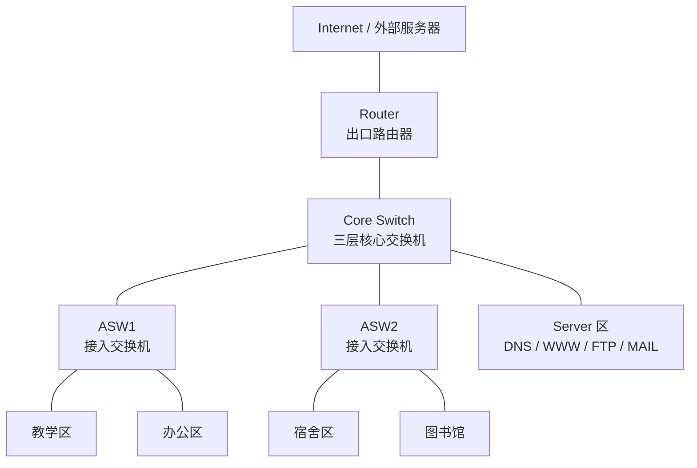

# 仿真实现说明



## 1. 仿真目的

本次仿真基于 Cisco Packet Tracer 搭建一个基础校园网络，验证概要设计中的核心功能是否能够实现。仿真重点不是追求复杂网络规模，而是先完成校园网的基本结构，包括区域划分、VLAN 隔离、跨 VLAN 通信、服务器访问和出口路由。

## 2. 仿真拓扑说明

仿真网络采用简单的分层结构：

1. 出口层由 1 台 Router 组成，用于连接校园网和外部网络。
2. 核心层由 1 台三层 Core Switch 组成，用于汇聚接入交换机和服务器区，同时承担 VLAN 网关功能。
3. 接入层由 ASW1、ASW2 两台二层交换机组成，用于连接教学区、办公区、宿舍区和图书馆终端。
4. 服务器区直接连接到核心交换机，集中部署 DNS、WWW、FTP、MAIL 等服务。
5. 外部服务器可以作为可选设备，用于模拟 Internet 或校外资源访问。

整体连接关系为：外部服务器连接 Router，Router 连接 Core Switch，Core Switch 分别连接 ASW1、ASW2 和服务器区，ASW1 下接教学区和办公区，ASW2 下接宿舍区和图书馆。

## 3. 仿真模块划分

| 模块 | 仿真设备 | 实现内容 |
| --- | --- | --- |
| 出口模块 | Router | 配置校园网出口地址和静态路由 |
| 核心交换模块 | Core Switch | 创建 VLAN、配置 SVI 网关、开启三层路由 |
| 接入模块 | ASW1、ASW2 | 配置 Access 端口和 Trunk 上联端口 |
| 用户模块 | PC 终端 | 模拟不同区域的用户访问行为 |
| 服务器模块 | Server | 提供 DNS、WWW、FTP、MAIL 服务 |
| 外部网络模块 | 外部服务器，可选 | 模拟 Internet 访问目标 |

## 4. VLAN 与地址实现

本仿真按照功能区域划分 VLAN，每个 VLAN 使用独立网段，并由核心交换机提供网关。

| VLAN | 区域 | 网段 | 网关 | 说明 |
| --- | --- | --- | --- | --- |
| VLAN 10 | 教学区 | 192.168.10.0/24 | 192.168.10.1 | 教学终端接入 |
| VLAN 20 | 办公区 | 192.168.20.0/24 | 192.168.20.1 | 办公终端接入 |
| VLAN 30 | 宿舍区 | 192.168.30.0/24 | 192.168.30.1 | 学生宿舍终端接入 |
| VLAN 40 | 图书馆 | 192.168.40.0/24 | 192.168.40.1 | 图书馆终端接入 |
| VLAN 50 | 服务器区 | 192.168.50.0/24 | 192.168.50.1 | DNS、WWW、FTP、MAIL 服务器 |
| VLAN 99 | 管理区 | 192.168.99.0/24 | 192.168.99.1 | 网络设备管理预留 |

核心交换机通过 `interface vlan` 配置各 VLAN 的三层接口，例如 VLAN 10 的网关为 `192.168.10.1`，VLAN 50 的网关为 `192.168.50.1`。用户终端和服务器将各自 VLAN 的网关作为默认网关。

## 5. 交换部分实现

接入交换机主要完成用户终端接入：

- ASW1 连接教学区和办公区终端。
- ASW2 连接宿舍区和图书馆终端。
- 接入终端的端口配置为 Access 模式，并划入对应 VLAN。
- 接入交换机上联核心交换机的端口配置为 Trunk 模式，使多个 VLAN 的数据能够通过同一条上联链路传输。

核心交换机主要完成 VLAN 汇聚和三层转发：

- 在核心交换机上创建所有 VLAN。
- 为每个 VLAN 配置 SVI 网关。
- 开启 `ip routing`，使核心交换机具备跨 VLAN 路由能力。
- 将服务器端口划入 VLAN 50。
- 将连接 ASW1、ASW2 的端口配置为 Trunk。

## 6. 路由部分实现

本仿真采用静态路由方式，配置简单，便于课程设计展示。

核心交换机上配置默认路由：

```cisco
ip route 0.0.0.0 0.0.0.0 192.168.100.1
```

该路由表示：当核心交换机收到目的地址不属于校园内部网段的数据包时，将其转发给出口路由器。

出口路由器上配置返回校园网的静态路由：

```cisco
ip route 192.168.0.0 255.255.0.0 192.168.100.2
```

该路由表示：出口路由器访问校园内部 `192.168.0.0/16` 网段时，将数据转发回核心交换机。

核心交换机与出口路由器之间使用 `192.168.100.0/30` 作为点到点链路网段：

| 设备 | 接口地址 |
| --- | --- |
| Router | 192.168.100.1/30 |
| Core Switch | 192.168.100.2/30 |

## 7. 服务器服务实现

服务器统一部署在 VLAN 50，便于集中管理和后续访问控制。

| 服务 | IP 地址 | 实现方式 |
| --- | --- | --- |
| DNS | 192.168.50.10 | 在 Server 的 Services -> DNS 中开启，并添加域名记录 |
| WWW | 192.168.50.20 | 在 Server 的 Services -> HTTP 中开启 Web 服务 |
| FTP | 192.168.50.30 | 在 Server 的 Services -> FTP 中开启文件服务并添加用户 |
| MAIL | 192.168.50.40 | 在 Server 的 Services -> EMAIL 中配置邮件域和用户 |

DNS 中建议添加以下记录：

| 域名 | IP 地址 | 用途 |
| --- | --- | --- |
| www.school.local | 192.168.50.20 | 校园门户网站 |
| ftp.school.local | 192.168.50.30 | 文件传输服务 |
| mail.school.local | 192.168.50.40 | 邮件服务 |

用户终端的 DNS 地址统一配置为 `192.168.50.10`，这样可以通过域名访问校园内部服务。

## 8. 仿真实现流程

仿真过程按以下顺序完成：

1. 在 Packet Tracer 中放置 Router、Core Switch、ASW1、ASW2、服务器和 PC。
2. 按拓扑结构连接设备。
3. 在核心交换机和接入交换机上创建 VLAN。
4. 在接入交换机上配置 Access 端口和 Trunk 端口。
5. 在核心交换机上配置 SVI 网关并开启 `ip routing`。
6. 配置核心交换机与出口路由器之间的三层链路。
7. 在核心交换机和路由器上配置静态路由。
8. 为 PC 和服务器配置 IP 地址、子网掩码、默认网关和 DNS 地址。
9. 在服务器上开启 DNS、WWW、FTP、MAIL 服务。
10. 使用 ping、浏览器、FTP 和邮件客户端测试网络功能。

## 9. 功能验证

仿真完成后，需要验证以下功能：

| 测试内容 | 测试方法 | 预期结果 |
| --- | --- | --- |
| 终端到网关连通 | PC ping 本 VLAN 网关 | 可以 ping 通 |
| 跨 VLAN 通信 | 教学区 PC ping 办公区 PC | 可以 ping 通 |
| 访问服务器区 | PC ping 192.168.50.20 | 可以 ping 通 WWW 服务器 |
| DNS 解析 | PC 访问 www.school.local | 能解析到 192.168.50.20 |
| Web 访问 | 浏览器访问 http://www.school.local | 能打开校园门户页面 |
| FTP 访问 | FTP 客户端访问 ftp.school.local | 能登录并传输文件 |
| 邮件服务 | 邮件客户端使用 mail.school.local | 能完成邮件收发测试 |
| 出口路由 | PC ping 192.168.100.1 | 能到达出口路由器 |
| 外部访问，可选 | PC ping 外部服务器地址 | 能访问外部服务器 |

## 10. 仿真结果说明

当各区域 PC 能够 ping 通本 VLAN 网关，说明终端接入和 VLAN 网关配置正确；当不同 VLAN 的 PC 可以互相 ping 通，说明核心交换机的三层路由功能正常；当 PC 能访问服务器区的 WWW、FTP、MAIL 服务，说明服务器区规划和业务服务配置正常；当 PC 能访问出口路由器或外部服务器，说明校园网出口链路和静态路由配置正确。

通过本次仿真可以证明，该校园网络拓扑能够满足基础校园网的使用需求，并且采用模块化结构，后续可以继续扩展无线网络、访问控制、链路冗余和更多服务器业务。
