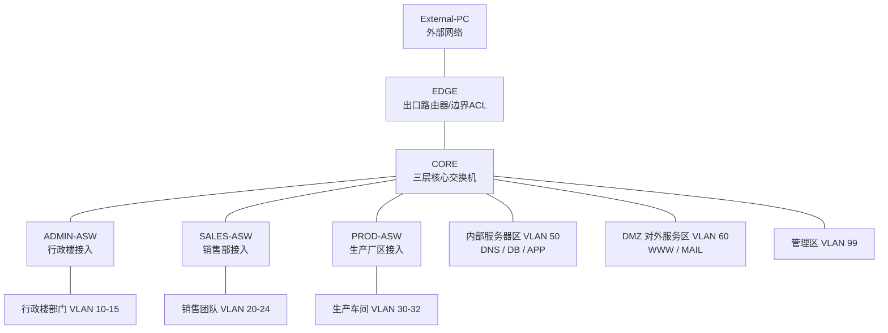

# 仿真实现说明



## 1. 仿真目的

本次仿真基于 Cisco Packet Tracer 搭建企业网络，验证新命题文件中“中小型网络工程设计与实现”的主要要求。仿真重点包括企业三建筑接入、VLAN 隔离、三层互通、内部服务器保护、对外服务发布和内部用户访问外部网络。

## 2. 仿真拓扑说明

仿真网络采用分层结构：

1. 出口层由 EDGE 路由器组成，用于连接企业内网和外部网络，并通过 ACL 模拟防火墙。
2. 核心层由 CORE 三层交换机组成，部署在行政楼中心机房，承担 VLAN 网关、三层转发和服务器汇聚功能。
3. 接入层由 ADMIN-ASW、SALES-ASW、PROD-ASW 三台二层交换机组成，分别连接行政楼、销售部和生产厂区用户。
4. 内部服务器区 VLAN 50 部署 DNS、数据库服务器和重要业务服务器。
5. DMZ 对外服务区 VLAN 60 部署 WWW 和 MAIL，允许内外访问。
6. 外部网络使用 External-PC 模拟，用于验证对外服务访问和内部服务器保护策略。

整体连接关系为：External-PC 连接 EDGE 外侧接口，EDGE 内侧接口连接 CORE，CORE 分别连接三台接入交换机、内部服务器区和 DMZ 服务区。

## 3. 仿真模块划分

| 模块 | 仿真设备 | 实现内容 |
| --- | --- | --- |
| 出口模块 | EDGE | 内外接口、静态路由、NAT、外部访问 ACL |
| 核心交换模块 | CORE | VLAN 创建、SVI 网关、三层路由、默认路由 |
| 行政楼接入 | ADMIN-ASW | 接入总经理办公室、人力资源部、财务部、技术部、工会、保卫和后勤 |
| 销售部接入 | SALES-ASW | 接入销售一队至销售五队 |
| 生产厂区接入 | PROD-ASW | 接入一车间至三车间 |
| 内部服务器模块 | DNS、DB、APP Server | 内部解析、数据库服务、重要业务服务 |
| 对外服务模块 | WWW、MAIL Server | 对外网站和邮件服务 |
| 外部网络模块 | External-PC | 模拟企业外部访问者 |

## 4. VLAN 与地址实现

本仿真按照企业组织结构划分 VLAN。不同部门、团队和车间使用不同 VLAN，因此不能进行二层通信；如果需要互访，流量必须经过 CORE 的三层网关。

| VLAN | 区域 | 网段 | 网关 |
| --- | --- | --- | --- |
| 10 | 总经理办公室 | 192.168.10.0/24 | 192.168.10.1 |
| 11 | 人力资源部 | 192.168.11.0/24 | 192.168.11.1 |
| 12 | 财务部 | 192.168.12.0/24 | 192.168.12.1 |
| 13 | 技术部 | 192.168.13.0/24 | 192.168.13.1 |
| 14 | 工会 | 192.168.14.0/24 | 192.168.14.1 |
| 15 | 保卫和后勤 | 192.168.15.0/24 | 192.168.15.1 |
| 20-24 | 销售一队至五队 | 192.168.20.0/24 - 192.168.24.0/24 | 192.168.20.1 - 192.168.24.1 |
| 30-32 | 一车间至三车间 | 192.168.30.0/24 - 192.168.32.0/24 | 192.168.30.1 - 192.168.32.1 |
| 50 | 内部服务器区 | 192.168.50.0/24 | 192.168.50.1 |
| 60 | DMZ 对外服务区 | 192.168.60.0/24 | 192.168.60.1 |
| 99 | 网络管理区 | 192.168.99.0/24 | 192.168.99.1 |

CORE 与 EDGE 之间使用 `192.168.100.0/30` 点到点链路，EDGE 外侧使用 `200.1.1.0/24` 模拟外部网络。

## 5. 交换部分实现

接入交换机负责用户终端接入：

- ADMIN-ASW 上联 CORE，下联 VLAN 10-15 的行政楼部门终端。
- SALES-ASW 上联 CORE，下联 VLAN 20-24 的销售团队终端。
- PROD-ASW 上联 CORE，下联 VLAN 30-32 的生产车间终端。
- 各终端端口配置为 Access 模式，并划入对应 VLAN。
- 各接入交换机上联 CORE 的端口配置为 Trunk，只放行本区域需要的 VLAN 和管理 VLAN。

CORE 负责 VLAN 汇聚和三层转发：

- 在 CORE 上创建所有业务 VLAN。
- 为每个 VLAN 创建 SVI 接口，作为该 VLAN 默认网关。
- 开启 `ip routing`，实现不同 VLAN 之间的三层通信。
- 将内部服务器接入口划入 VLAN 50。
- 将 WWW、MAIL 服务器接入口划入 VLAN 60。
- 将连接 EDGE 的接口配置为三层接口，并配置默认路由。

## 6. 路由与边界控制实现

内部路由由 CORE 完成，外部访问由 EDGE 控制。

CORE 默认路由：

```cisco
ip route 0.0.0.0 0.0.0.0 192.168.100.1
```

EDGE 回程路由：

```cisco
ip route 192.168.0.0 255.255.0.0 192.168.100.2
```

EDGE 外侧接口配置 ACL，允许外部网络访问 DMZ 中的 WWW 和 MAIL 服务，拒绝访问企业内部网段。关键策略如下：

```cisco
ip access-list extended OUTSIDE-IN
 permit tcp any host 192.168.60.20 eq 80
 permit tcp any host 192.168.60.40 eq 25
 permit tcp any host 192.168.60.40 eq 110
 deny ip any 192.168.0.0 0.0.255.255
 permit ip any any
```

该策略体现了题目要求：中心机房中的数据库服务器和重要业务服务器禁止外部访问，对外只开放必要的 WWW 和 MAIL 服务。

## 7. 服务器服务实现

服务器规划如下：

| 服务 | IP 地址 | 所属区域 | 实现方式 |
| --- | --- | --- | --- |
| DNS | 192.168.50.10 | 内部服务器区 | 在 Server 的 Services -> DNS 中开启 |
| DB | 192.168.50.30 | 内部服务器区 | 模拟数据库服务器，仅内部访问 |
| APP | 192.168.50.40 | 内部服务器区 | 模拟重要业务服务器，仅内部访问 |
| WWW | 192.168.60.20 | DMZ 对外服务区 | 在 Server 的 Services -> HTTP 中开启 |
| MAIL | 192.168.60.40 | DMZ 对外服务区 | 在 Server 的 Services -> EMAIL 中开启 SMTP/POP3 |

DNS 中建议添加以下记录：

| 域名 | IP 地址 | 用途 |
| --- | --- | --- |
| www.company.local | 192.168.60.20 | 企业对外网站 |
| mail.company.local | 192.168.60.40 | 企业邮件服务 |
| db.company.local | 192.168.50.30 | 内部数据库服务 |
| app.company.local | 192.168.50.40 | 内部业务服务 |

用户终端的 DNS 地址统一配置为 `192.168.50.10`，便于通过域名访问企业服务。

## 8. 仿真实现流程

仿真过程按以下顺序完成：

1. 在 Packet Tracer 中放置 EDGE、CORE、三台接入交换机、服务器和 PC。
2. 按拓扑结构连接设备。
3. 在 CORE 和接入交换机上创建 VLAN。
4. 在接入交换机上配置 Access 端口和 Trunk 上联端口。
5. 在 CORE 上配置 SVI 网关并开启 `ip routing`。
6. 配置 CORE 与 EDGE 之间的三层链路。
7. 在 CORE 和 EDGE 上配置静态路由。
8. 在 EDGE 上配置 NAT 和外部访问 ACL。
9. 为 PC 和服务器配置 IP 地址、子网掩码、默认网关和 DNS 地址。
10. 在服务器上开启 DNS、WWW、MAIL 服务。
11. 使用 ping、浏览器、邮件客户端和 ACL 命中计数验证功能。

## 9. 功能验证

仿真完成后，需要验证以下功能：

| 测试内容 | 测试方法 | 预期结果 |
| --- | --- | --- |
| 终端到本 VLAN 网关 | GM-PC ping `192.168.10.1` | 成功 |
| 不同 VLAN 三层通信 | GM-PC ping HR-PC | 成功，说明通过三层网关互通 |
| 内部 DNS 访问 | 用户 PC ping `192.168.50.10` | 成功 |
| 内部访问 WWW | 用户 PC 访问 `http://www.company.local` | 成功 |
| 内部访问 MAIL | 用户 PC 使用 `mail.company.local` 收发邮件 | 成功 |
| 内部访问外部网络 | 用户 PC ping `200.1.1.10` | 成功 |
| 外部访问 WWW | External-PC 访问 `http://192.168.60.20` | 成功 |
| 外部访问内部 DB | External-PC 访问或 ping `192.168.50.30` | 失败 |
| 外部访问内部 APP | External-PC 访问或 ping `192.168.50.40` | 失败 |

## 10. 仿真结果说明

当各 VLAN 终端能够访问本 VLAN 网关，说明接入端口、VLAN 和 SVI 配置正确；当不同 VLAN 终端可以通信，说明 CORE 的三层转发功能正常；当内部用户可以访问 WWW、MAIL 和外部网络，说明企业内部业务访问需求得到满足；当 External-PC 可以访问 WWW 但不能访问 DB 和 APP，说明边界访问控制符合“重要服务器禁止外部访问”的要求。

通过本次仿真可以证明，该企业网络拓扑能够满足新命题文件中的基础需求，并保留继续扩展 ACL 精细控制、DHCP、链路冗余和防火墙设备的空间。
