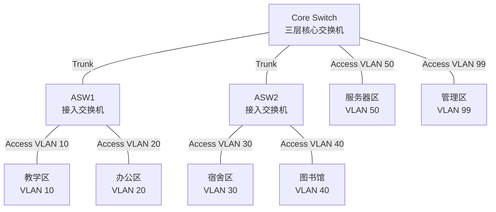

# VLAN 划分表

## 1. VLAN 划分原则

校园网按照功能区域划分 VLAN。不同区域使用不同 VLAN，可以减少广播范围，提高网络结构清晰度，并为后续访问控制和安全策略配置提供基础。

本设计先采用基础 VLAN，满足教学区、办公区、宿舍区、图书馆、服务器区和管理区的基本接入需求。

## 2. VLAN 规划表

| VLAN ID | VLAN 名称 | 所属区域 | 网段 | 默认网关 | 主要接入设备 | 说明 |
| --- | --- | --- | --- | --- | --- | --- |
| VLAN 10 | TEACHING | 教学区 | 192.168.10.0/24 | 192.168.10.1 | ASW1 | 教室、实验室等教学终端接入 |
| VLAN 20 | OFFICE | 办公区 | 192.168.20.0/24 | 192.168.20.1 | ASW1 | 教师和行政办公终端接入 |
| VLAN 30 | DORMITORY | 宿舍区 | 192.168.30.0/24 | 192.168.30.1 | ASW2 | 学生宿舍终端接入 |
| VLAN 40 | LIBRARY | 图书馆 | 192.168.40.0/24 | 192.168.40.1 | ASW2 | 图书馆查询终端和读者终端接入 |
| VLAN 50 | SERVER | 服务器区 | 192.168.50.0/24 | 192.168.50.1 | Core Switch | DNS、WWW、FTP、MAIL 等服务器接入 |
| VLAN 99 | MANAGEMENT | 管理区 | 192.168.99.0/24 | 192.168.99.1 | Core Switch | 网络设备管理和管理员终端预留 |

## 3. VLAN 拓扑关系



## 4. 端口划分建议

| 设备 | 端口 | 模式 | 所属 VLAN / 允许 VLAN | 连接对象 |
| --- | --- | --- | --- | --- |
| ASW1 | F0/1 | Access | VLAN 10 | 教学区 PC |
| ASW1 | F0/2 | Access | VLAN 20 | 办公区 PC |
| ASW1 | F0/24 | Trunk | VLAN 10、20 | Core Switch |
| ASW2 | F0/1 | Access | VLAN 30 | 宿舍区 PC |
| ASW2 | F0/2 | Access | VLAN 40 | 图书馆 PC |
| ASW2 | F0/24 | Trunk | VLAN 30、40 | Core Switch |
| Core Switch | F0/1 | Trunk | VLAN 10、20 | ASW1 |
| Core Switch | F0/2 | Trunk | VLAN 30、40 | ASW2 |
| Core Switch | F0/3-F0/6 | Access | VLAN 50 | DNS、WWW、FTP、MAIL 服务器 |
| Core Switch | F0/7 | Access | VLAN 99 | 管理终端 |

## 5. 配置说明

核心交换机和接入交换机都需要创建相应 VLAN。接入终端的端口配置为 Access 模式，上联核心交换机的端口配置为 Trunk 模式。

核心交换机上为每个 VLAN 创建 SVI 接口，作为该 VLAN 的默认网关。例如：

```cisco
interface vlan 10
 ip address 192.168.10.1 255.255.255.0
 no shutdown
```

各终端的默认网关应配置为本 VLAN 对应的网关地址。