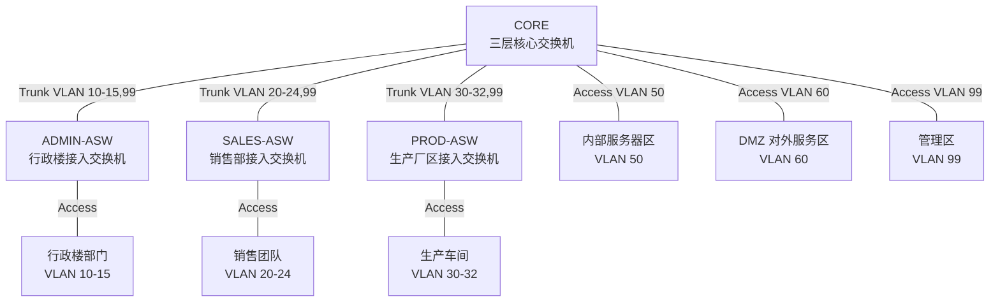

# VLAN 划分表

## 1. VLAN 划分原则

企业网络按照组织结构和服务安全级别划分 VLAN。行政楼 6 个部门、销售部 5 个团队、生产厂区 3 个车间分别使用独立 VLAN，保证不同部门、团队、车间之间不能二层通信；内部服务器区、DMZ 对外服务区和管理区也单独划分 VLAN，便于后续访问控制和运维管理。

本设计采用以下原则：

1. 一个部门、团队或车间对应一个独立用户 VLAN。
2. 数据库服务器和重要业务服务器放入内部服务器 VLAN。
3. WWW 和 MAIL 等对外服务放入 DMZ VLAN。
4. 网络设备管理地址和管理员主机放入管理 VLAN。
5. 接入交换机到核心交换机之间使用 Trunk，只放行本区域需要的 VLAN。

## 2. VLAN 规划表

| VLAN ID | VLAN 名称 | 所属区域 | 网段 | 默认网关 | 主要接入设备 | 说明 |
| --- | --- | --- | --- | --- | --- | --- |
| VLAN 10 | ADMIN_GM | 总经理办公室 | 192.168.10.0/24 | 192.168.10.1 | ADMIN-ASW | 行政楼部门终端接入 |
| VLAN 11 | ADMIN_HR | 人力资源部 | 192.168.11.0/24 | 192.168.11.1 | ADMIN-ASW | 行政楼部门终端接入 |
| VLAN 12 | ADMIN_FINANCE | 财务部 | 192.168.12.0/24 | 192.168.12.1 | ADMIN-ASW | 财务部终端接入，后续可加强访问控制 |
| VLAN 13 | ADMIN_TECH | 技术部 | 192.168.13.0/24 | 192.168.13.1 | ADMIN-ASW | 技术部终端接入 |
| VLAN 14 | ADMIN_UNION | 工会 | 192.168.14.0/24 | 192.168.14.1 | ADMIN-ASW | 工会终端接入 |
| VLAN 15 | ADMIN_SEC_LOG | 保卫和后勤 | 192.168.15.0/24 | 192.168.15.1 | ADMIN-ASW | 保卫和后勤终端接入 |
| VLAN 20 | SALES_T1 | 销售一队 | 192.168.20.0/24 | 192.168.20.1 | SALES-ASW | 销售团队终端接入 |
| VLAN 21 | SALES_T2 | 销售二队 | 192.168.21.0/24 | 192.168.21.1 | SALES-ASW | 销售团队终端接入 |
| VLAN 22 | SALES_T3 | 销售三队 | 192.168.22.0/24 | 192.168.22.1 | SALES-ASW | 销售团队终端接入 |
| VLAN 23 | SALES_T4 | 销售四队 | 192.168.23.0/24 | 192.168.23.1 | SALES-ASW | 销售团队终端接入 |
| VLAN 24 | SALES_T5 | 销售五队 | 192.168.24.0/24 | 192.168.24.1 | SALES-ASW | 销售团队终端接入 |
| VLAN 30 | PROD_WS1 | 一车间 | 192.168.30.0/24 | 192.168.30.1 | PROD-ASW | 生产车间终端接入 |
| VLAN 31 | PROD_WS2 | 二车间 | 192.168.31.0/24 | 192.168.31.1 | PROD-ASW | 生产车间终端接入 |
| VLAN 32 | PROD_WS3 | 三车间 | 192.168.32.0/24 | 192.168.32.1 | PROD-ASW | 生产车间终端接入 |
| VLAN 50 | SERVER_IN | 内部服务器区 | 192.168.50.0/24 | 192.168.50.1 | CORE | DNS、DB、APP 等内部服务器接入 |
| VLAN 60 | DMZ_SERVICE | DMZ 对外服务区 | 192.168.60.0/24 | 192.168.60.1 | CORE | WWW、MAIL 等对外服务接入 |
| VLAN 99 | MANAGEMENT | 管理区 | 192.168.99.0/24 | 192.168.99.1 | CORE | 管理员主机和网络设备管理地址 |

## 3. VLAN 拓扑关系



## 4. 端口划分建议

| 设备 | 端口 | 模式 | 所属 VLAN / 允许 VLAN | 连接对象 |
| --- | --- | --- | --- | --- |
| ADMIN-ASW | F0/1 | Access | VLAN 10 | GM-PC |
| ADMIN-ASW | F0/2 | Access | VLAN 11 | HR-PC |
| ADMIN-ASW | F0/3 | Access | VLAN 12 | FIN-PC |
| ADMIN-ASW | F0/4 | Access | VLAN 13 | TECH-PC |
| ADMIN-ASW | F0/5 | Access | VLAN 14 | UNION-PC |
| ADMIN-ASW | F0/6 | Access | VLAN 15 | SECLOG-PC |
| ADMIN-ASW | F0/24 | Trunk | VLAN 10-15、99 | CORE |
| SALES-ASW | F0/1 | Access | VLAN 20 | SALES1-PC |
| SALES-ASW | F0/2 | Access | VLAN 21 | SALES2-PC |
| SALES-ASW | F0/3 | Access | VLAN 22 | SALES3-PC |
| SALES-ASW | F0/4 | Access | VLAN 23 | SALES4-PC |
| SALES-ASW | F0/5 | Access | VLAN 24 | SALES5-PC |
| SALES-ASW | F0/24 | Trunk | VLAN 20-24、99 | CORE |
| PROD-ASW | F0/1 | Access | VLAN 30 | WS1-PC |
| PROD-ASW | F0/2 | Access | VLAN 31 | WS2-PC |
| PROD-ASW | F0/3 | Access | VLAN 32 | WS3-PC |
| PROD-ASW | F0/24 | Trunk | VLAN 30-32、99 | CORE |
| CORE | F0/1 | Trunk | VLAN 10-15、99 | ADMIN-ASW |
| CORE | F0/2 | Trunk | VLAN 20-24、99 | SALES-ASW |
| CORE | F0/3 | Trunk | VLAN 30-32、99 | PROD-ASW |
| CORE | F0/4-F0/6 | Access | VLAN 50 | DNS、DB、APP Server |
| CORE | F0/7-F0/8 | Access | VLAN 60 | WWW、MAIL Server |
| CORE | F0/9 | Access | VLAN 99 | MGMT-PC |

## 5. 配置说明

CORE 和各接入交换机都需要创建对应 VLAN。接入终端的端口配置为 Access 模式，上联 CORE 的端口配置为 Trunk 模式。

CORE 上为每个 VLAN 创建 SVI 接口，作为该 VLAN 的默认网关。例如：

```cisco
interface vlan 10
 ip address 192.168.10.1 255.255.255.0
 no shutdown
```

各终端的默认网关应配置为本 VLAN 对应的 SVI 地址。不同部门、团队和车间之间虽然可以通过 CORE 进行三层通信，但它们不在同一个二层广播域中，满足不能二层通信的要求。
