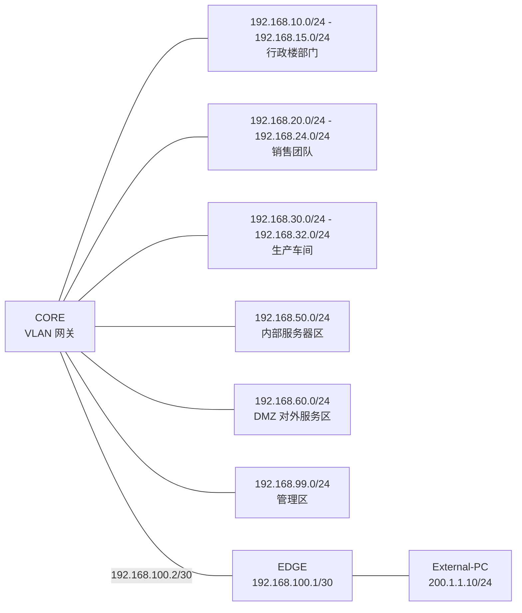

# 地址规划表

## 1. 地址规划原则

企业内网统一使用私有地址段 `192.168.0.0/16`。每个部门、团队、车间和服务器区域分配一个独立的 `/24` 子网，便于配置、扩展和故障排查。

核心交换机 CORE 为各 VLAN 提供默认网关，服务器采用固定 IP 地址，用户终端在仿真中采用静态地址配置，后续可扩展为 DHCP 自动分配。

## 2. VLAN 地址规划

| VLAN | 区域 | 子网地址 | 子网掩码 | 默认网关 | 可用地址范围 |
| --- | --- | --- | --- | --- | --- |
| VLAN 10 | 总经理办公室 | 192.168.10.0 | 255.255.255.0 | 192.168.10.1 | 192.168.10.2 - 192.168.10.254 |
| VLAN 11 | 人力资源部 | 192.168.11.0 | 255.255.255.0 | 192.168.11.1 | 192.168.11.2 - 192.168.11.254 |
| VLAN 12 | 财务部 | 192.168.12.0 | 255.255.255.0 | 192.168.12.1 | 192.168.12.2 - 192.168.12.254 |
| VLAN 13 | 技术部 | 192.168.13.0 | 255.255.255.0 | 192.168.13.1 | 192.168.13.2 - 192.168.13.254 |
| VLAN 14 | 工会 | 192.168.14.0 | 255.255.255.0 | 192.168.14.1 | 192.168.14.2 - 192.168.14.254 |
| VLAN 15 | 保卫和后勤 | 192.168.15.0 | 255.255.255.0 | 192.168.15.1 | 192.168.15.2 - 192.168.15.254 |
| VLAN 20 | 销售一队 | 192.168.20.0 | 255.255.255.0 | 192.168.20.1 | 192.168.20.2 - 192.168.20.254 |
| VLAN 21 | 销售二队 | 192.168.21.0 | 255.255.255.0 | 192.168.21.1 | 192.168.21.2 - 192.168.21.254 |
| VLAN 22 | 销售三队 | 192.168.22.0 | 255.255.255.0 | 192.168.22.1 | 192.168.22.2 - 192.168.22.254 |
| VLAN 23 | 销售四队 | 192.168.23.0 | 255.255.255.0 | 192.168.23.1 | 192.168.23.2 - 192.168.23.254 |
| VLAN 24 | 销售五队 | 192.168.24.0 | 255.255.255.0 | 192.168.24.1 | 192.168.24.2 - 192.168.24.254 |
| VLAN 30 | 一车间 | 192.168.30.0 | 255.255.255.0 | 192.168.30.1 | 192.168.30.2 - 192.168.30.254 |
| VLAN 31 | 二车间 | 192.168.31.0 | 255.255.255.0 | 192.168.31.1 | 192.168.31.2 - 192.168.31.254 |
| VLAN 32 | 三车间 | 192.168.32.0 | 255.255.255.0 | 192.168.32.1 | 192.168.32.2 - 192.168.32.254 |
| VLAN 50 | 内部服务器区 | 192.168.50.0 | 255.255.255.0 | 192.168.50.1 | 192.168.50.2 - 192.168.50.254 |
| VLAN 60 | DMZ 对外服务区 | 192.168.60.0 | 255.255.255.0 | 192.168.60.1 | 192.168.60.2 - 192.168.60.254 |
| VLAN 99 | 管理区 | 192.168.99.0 | 255.255.255.0 | 192.168.99.1 | 192.168.99.2 - 192.168.99.254 |

## 3. 出口链路地址规划

CORE 和 EDGE 之间使用点到点链路地址：

| 链路 | 子网 | 设备 | 接口地址 | 说明 |
| --- | --- | --- | --- | --- |
| CORE ↔ EDGE | 192.168.100.0/30 | EDGE G0/0 | 192.168.100.1 | 出口路由器内侧接口 |
| CORE ↔ EDGE | 192.168.100.0/30 | CORE G0/1 | 192.168.100.2 | 核心交换机三层接口 |

外部模拟网络使用以下地址：

| 设备 | IP 地址 | 子网掩码 | 默认网关 |
| --- | --- | --- | --- |
| EDGE G0/1 | 200.1.1.1 | 255.255.255.0 | 无 |
| External-PC | 200.1.1.10 | 255.255.255.0 | 200.1.1.1 |

## 4. 服务器地址规划

| 服务器 | 所属 VLAN | IP 地址 | 子网掩码 | 默认网关 | DNS | 说明 |
| --- | --- | --- | --- | --- | --- | --- |
| DNS Server | VLAN 50 | 192.168.50.10 | 255.255.255.0 | 192.168.50.1 | 192.168.50.10 | 企业内部域名解析 |
| DB Server | VLAN 50 | 192.168.50.30 | 255.255.255.0 | 192.168.50.1 | 192.168.50.10 | 数据库服务器，禁止外部直接访问 |
| APP Server | VLAN 50 | 192.168.50.40 | 255.255.255.0 | 192.168.50.1 | 192.168.50.10 | 重要业务服务器，禁止外部直接访问 |
| WWW Server | VLAN 60 | 192.168.60.20 | 255.255.255.0 | 192.168.60.1 | 192.168.50.10 | 企业对外网站，内外均可访问 |
| MAIL Server | VLAN 60 | 192.168.60.40 | 255.255.255.0 | 192.168.60.1 | 192.168.50.10 | 企业邮件服务，内外均可访问 |

## 5. 终端地址规划示例

| 终端 | 所属区域 | IP 地址 | 子网掩码 | 默认网关 | DNS |
| --- | --- | --- | --- | --- | --- |
| GM-PC | 总经理办公室 | 192.168.10.10 | 255.255.255.0 | 192.168.10.1 | 192.168.50.10 |
| HR-PC | 人力资源部 | 192.168.11.10 | 255.255.255.0 | 192.168.11.1 | 192.168.50.10 |
| FIN-PC | 财务部 | 192.168.12.10 | 255.255.255.0 | 192.168.12.1 | 192.168.50.10 |
| TECH-PC | 技术部 | 192.168.13.10 | 255.255.255.0 | 192.168.13.1 | 192.168.50.10 |
| UNION-PC | 工会 | 192.168.14.10 | 255.255.255.0 | 192.168.14.1 | 192.168.50.10 |
| SECLOG-PC | 保卫和后勤 | 192.168.15.10 | 255.255.255.0 | 192.168.15.1 | 192.168.50.10 |
| SALES1-PC | 销售一队 | 192.168.20.10 | 255.255.255.0 | 192.168.20.1 | 192.168.50.10 |
| SALES2-PC | 销售二队 | 192.168.21.10 | 255.255.255.0 | 192.168.21.1 | 192.168.50.10 |
| SALES3-PC | 销售三队 | 192.168.22.10 | 255.255.255.0 | 192.168.22.1 | 192.168.50.10 |
| SALES4-PC | 销售四队 | 192.168.23.10 | 255.255.255.0 | 192.168.23.1 | 192.168.50.10 |
| SALES5-PC | 销售五队 | 192.168.24.10 | 255.255.255.0 | 192.168.24.1 | 192.168.50.10 |
| WS1-PC | 一车间 | 192.168.30.10 | 255.255.255.0 | 192.168.30.1 | 192.168.50.10 |
| WS2-PC | 二车间 | 192.168.31.10 | 255.255.255.0 | 192.168.31.1 | 192.168.50.10 |
| WS3-PC | 三车间 | 192.168.32.10 | 255.255.255.0 | 192.168.32.1 | 192.168.50.10 |
| MGMT-PC | 管理区 | 192.168.99.10 | 255.255.255.0 | 192.168.99.1 | 192.168.50.10 |

## 6. 地址分配示意图

