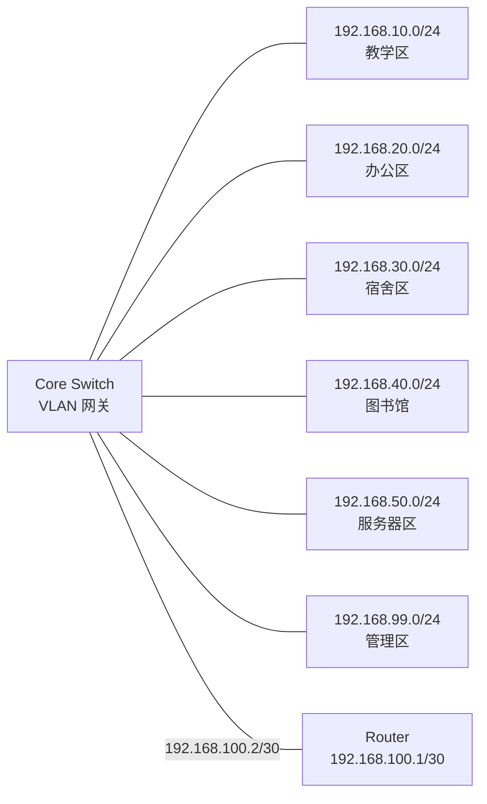

# 地址规划表

## 1. 地址规划原则

校园网内部统一使用私有地址段 `192.168.0.0/16`。每个功能区域分配一个独立的 `/24` 子网，便于后续扩展、管理和故障排查。

核心交换机为各 VLAN 提供默认网关，服务器采用固定 IP 地址，用户终端可手动配置或后续扩展为 DHCP 自动分配。

## 2. VLAN 地址规划

| VLAN | 区域 | 子网地址 | 子网掩码 | 默认网关 | 可用地址范围 |
| --- | --- | --- | --- | --- | --- |
| VLAN 10 | 教学区 | 192.168.10.0 | 255.255.255.0 | 192.168.10.1 | 192.168.10.2 - 192.168.10.254 |
| VLAN 20 | 办公区 | 192.168.20.0 | 255.255.255.0 | 192.168.20.1 | 192.168.20.2 - 192.168.20.254 |
| VLAN 30 | 宿舍区 | 192.168.30.0 | 255.255.255.0 | 192.168.30.1 | 192.168.30.2 - 192.168.30.254 |
| VLAN 40 | 图书馆 | 192.168.40.0 | 255.255.255.0 | 192.168.40.1 | 192.168.40.2 - 192.168.40.254 |
| VLAN 50 | 服务器区 | 192.168.50.0 | 255.255.255.0 | 192.168.50.1 | 192.168.50.2 - 192.168.50.254 |
| VLAN 99 | 管理区 | 192.168.99.0 | 255.255.255.0 | 192.168.99.1 | 192.168.99.2 - 192.168.99.254 |

## 3. 出口链路地址规划

核心交换机和出口路由器之间使用点到点链路地址：

| 链路 | 子网 | 设备 | 接口地址 | 说明 |
| --- | --- | --- | --- | --- |
| Core Switch ↔ Router | 192.168.100.0/30 | Router | 192.168.100.1 | 出口路由器内侧接口 |
| Core Switch ↔ Router | 192.168.100.0/30 | Core Switch | 192.168.100.2 | 核心交换机三层接口 |

如果需要模拟外部网络，可以使用以下地址：

| 设备 | IP 地址 | 子网掩码 | 默认网关 |
| --- | --- | --- | --- |
| Router 外侧接口 | 200.1.1.1 | 255.255.255.0 | 无 |
| 外部服务器 | 200.1.1.10 | 255.255.255.0 | 200.1.1.1 |

## 4. 服务器地址规划

| 服务器 | IP 地址 | 子网掩码 | 默认网关 | DNS | 说明 |
| --- | --- | --- | --- | --- | --- |
| DNS Server | 192.168.50.10 | 255.255.255.0 | 192.168.50.1 | 192.168.50.10 | 校园内部域名解析 |
| WWW Server | 192.168.50.20 | 255.255.255.0 | 192.168.50.1 | 192.168.50.10 | 校园门户网站 |
| FTP Server | 192.168.50.30 | 255.255.255.0 | 192.168.50.1 | 192.168.50.10 | 文件传输服务 |
| MAIL Server | 192.168.50.40 | 255.255.255.0 | 192.168.50.1 | 192.168.50.10 | 校园邮件服务 |

## 5. 终端地址规划示例

| 终端 | 所属区域 | IP 地址 | 子网掩码 | 默认网关 | DNS |
| --- | --- | --- | --- | --- | --- |
| PC-Teaching | 教学区 | 192.168.10.10 | 255.255.255.0 | 192.168.10.1 | 192.168.50.10 |
| PC-Office | 办公区 | 192.168.20.10 | 255.255.255.0 | 192.168.20.1 | 192.168.50.10 |
| PC-Dormitory | 宿舍区 | 192.168.30.10 | 255.255.255.0 | 192.168.30.1 | 192.168.50.10 |
| PC-Library | 图书馆 | 192.168.40.10 | 255.255.255.0 | 192.168.40.1 | 192.168.50.10 |
| PC-Management | 管理区 | 192.168.99.10 | 255.255.255.0 | 192.168.99.1 | 192.168.50.10 |

## 6. 地址分配示意图

