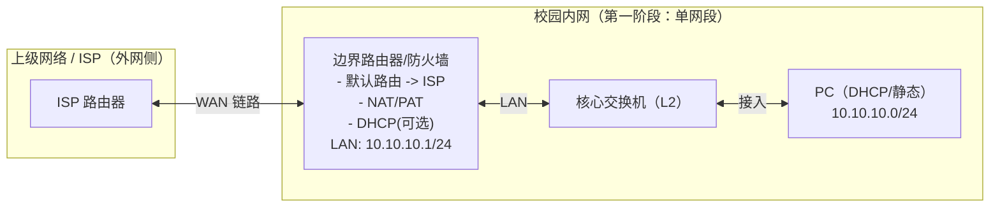

# 第一阶段：最小可用校园网（MVP）网络拓扑说明

## 目标

- 内网任意一台 PC 能获取 IP（DHCP）或手工配置 IP
- 内网 PC 能访问“外网”（通过边界设备默认路由 + NAT/PAT）
- 为后续逐步扩展 VLAN、三层互通、服务器区、安全策略打基础

## 角色与功能（最简）

- **ISP/上级网络**：提供“外网”连通性（在仿真里可用一台 ISP 路由器模拟）
- **边界路由器/防火墙（Edge）**：
  - 内网网关（例：`10.10.10.1/24`）
  - DHCP（可选：也可以先让 PC 静态配置）
  - 默认路由指向 ISP
  - NAT/PAT：将 `10.10.10.0/24` 出口做源 NAT
- **核心交换机（Core L2）**：二层转发，先不做 VLAN 划分（后续阶段再加）
- **PC（内网终端）**：验证 DHCP、网关连通、外网访问
- **（可选）外网服务器**：放在 ISP 一侧，用于稳定验证连通性（如 `ping`/HTTP）

## 拓扑图（Mermaid）

> 说明：这张图是“第一阶段”的最小闭环。后续加 VLAN/服务器区/冗余时，都在此基础上逐步演进。

## 地址示例（可按需替换）

- **内网网段**：`10.10.10.0/24`
- **边界设备 LAN 网关**：`10.10.10.1/24`
- **DHCP 分配范围**（示例）：`10.10.10.100 - 10.10.10.200`
- **DNS**：可先填运营商 DNS/公共 DNS，或后续自建 DNS
