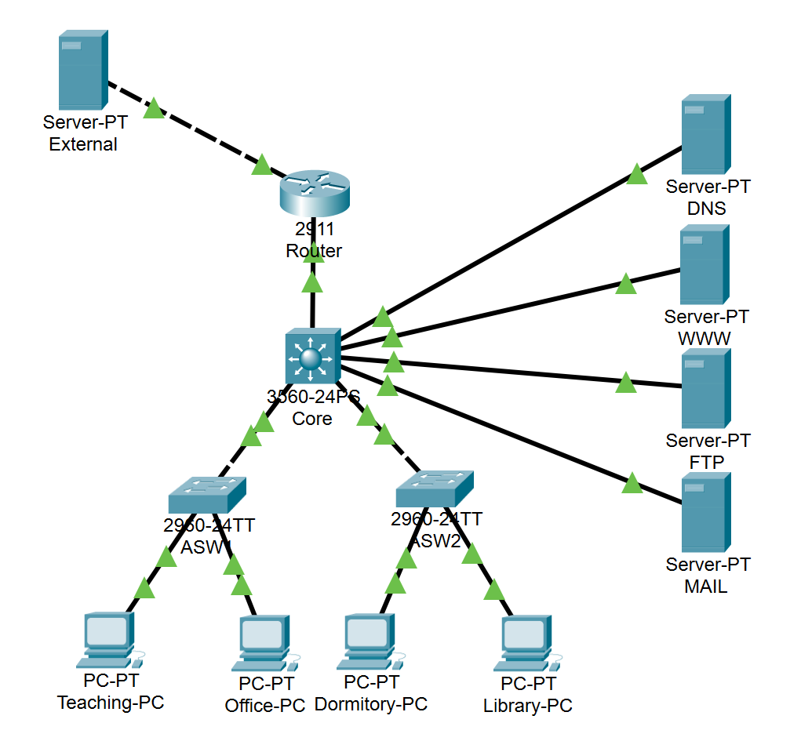
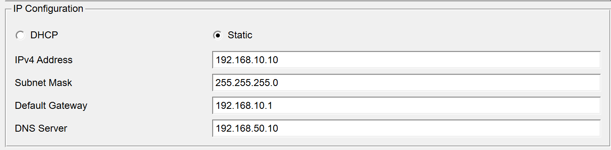
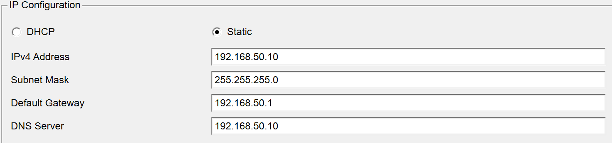
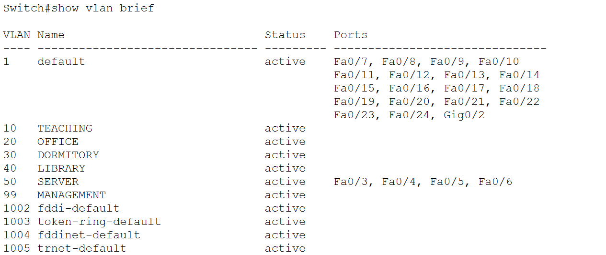
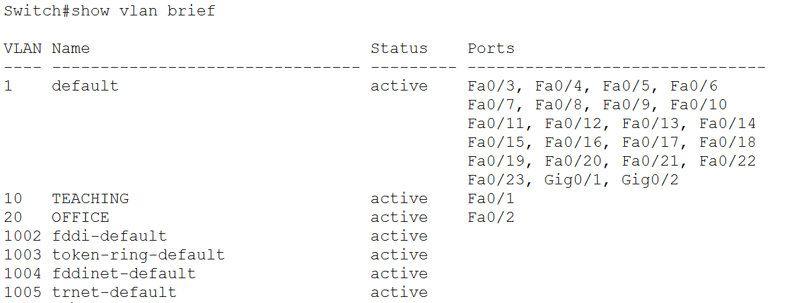
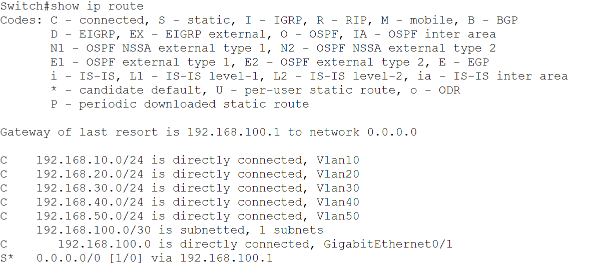
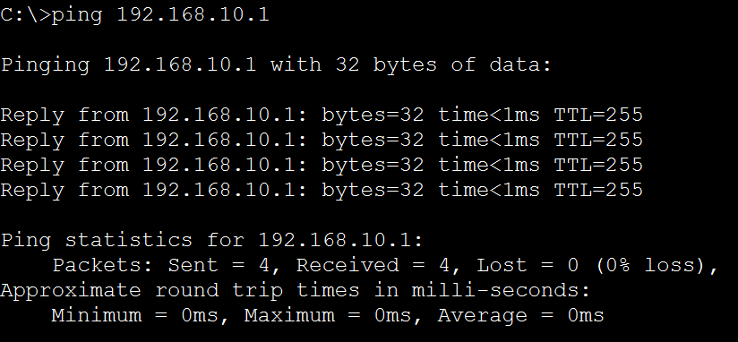
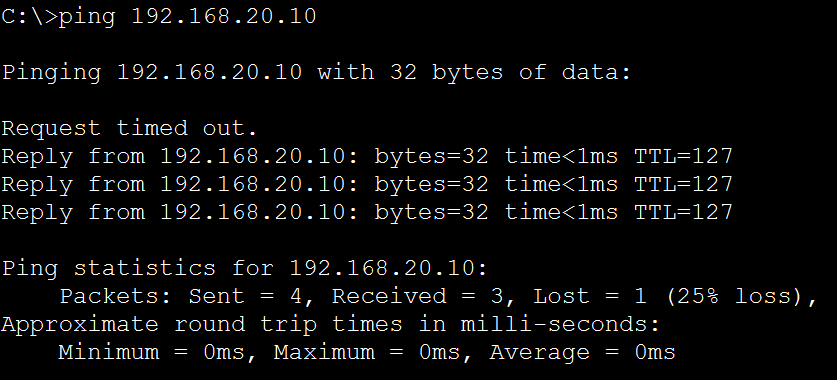
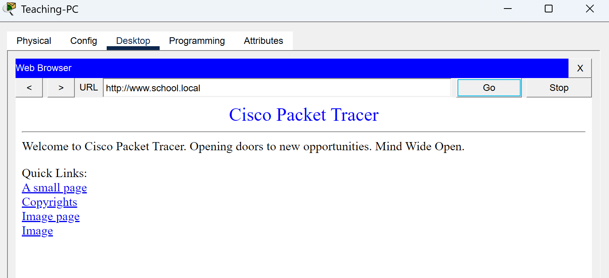

# 校园网络设计报告

作者：请填写姓名

学院、专业、班级：计算机与软件学院，请填写专业，请填写年级班

## 摘要

本报告针对中小型校园网络场景，完成网络需求分析、概要设计、详细设计和仿真调试分析。设计对象覆盖教学区、办公区、宿舍区、图书馆、服务器区和管理区，采用“出口路由器 + 三层核心交换机 + 接入交换机 + 服务器区”的分层结构。网络内部使用 VLAN 进行逻辑隔离，每个 VLAN 分配独立的 `/24` 子网，由核心交换机承担三层网关和跨 VLAN 路由功能；服务器区集中部署 DNS、WWW、FTP、MAIL 等基础服务；出口路由器负责校园网与外部网络之间的连接。通过 Cisco Packet Tracer 仿真，对 VLAN 划分、路由表、终端地址配置、本 VLAN 连通、跨 VLAN 通信和域名访问进行验证，结果表明该方案能够满足课程设计中对校园网络基础设施规划、实现和测试的要求。

关键词：校园网络；VLAN；子网规划；Packet Tracer；网络服务

## 1 需求分析

### 1.1 场景说明

本设计面向一个中小型校园网络，校园内包含教学区、办公区、宿舍区、图书馆、信息中心服务器区和网络管理区。不同区域的用户规模、访问权限和业务需求不同，因此网络设计不能只做简单互联，而应同时考虑地址规划、广播域控制、跨区访问、基础服务部署和后续扩展能力。

课程设计要求中明确提出，第一题“中小型网络工程设计与实现”需要完成需求分析、概要设计、详细设计和调试分析。其中需求分析部分应说明子网划分、VLAN、可选 ACL、WWW、FTP、MAIL、DNS 等服务以及服务支撑软件的主要原理；概要设计部分应给出网络拓扑结构和主要功能实现过程；详细设计部分应给出核心交换机和路由器配置清单；调试分析部分应采用网络模拟软件进行通信测试。

### 1.2 网络功能需求

| 需求类别 | 具体需求 | 设计响应 |
| --- | --- | --- |
| 区域划分 | 教学区、办公区、宿舍区、图书馆、服务器区、管理区需要独立管理 | 按功能区域划分 VLAN 10、20、30、40、50、99 |
| 地址规划 | 不同区域需要独立子网，便于管理和扩展 | 每个 VLAN 使用一个 `/24` 子网，出口链路使用 `/30` 点到点网段 |
| 区域隔离 | 减少广播范围，避免不同区域处于同一广播域 | 接入端口使用 Access 模式，上联端口使用 Trunk 模式 |
| 跨 VLAN 通信 | 不同区域需要访问服务器区，也需要进行必要的跨区通信测试 | 核心交换机配置 SVI，并开启三层路由 |
| 基础服务 | 校园门户、文件传输、邮件收发和域名解析 | 在 VLAN 50 部署 WWW、FTP、MAIL、DNS 服务器 |
| 出口访问 | 校园网需要预留访问外部网络能力 | 核心交换机和出口路由器之间配置三层链路和静态路由 |
| 管理与安全 | 网络设备管理流量应与普通用户流量分离 | 预留 VLAN 99 作为管理区，后续可扩展 ACL |

表 1 说明了校园网的主要需求和对应实现方式。该设计先保证基础连通和服务可用，再通过 VLAN、管理区和可选 ACL 为后续安全控制留出扩展空间。

### 1.3 VLAN 与子网需求

校园网络内部统一使用私有地址段 `192.168.0.0/16`，根据功能区域划分为多个子网。各区域的地址规划如下。

| VLAN | 区域 | 子网地址 | 子网掩码 | 默认网关 | 说明 |
| --- | --- | --- | --- | --- | --- |
| VLAN 10 | 教学区 | 192.168.10.0 | 255.255.255.0 | 192.168.10.1 | 教室、实验室等教学终端接入 |
| VLAN 20 | 办公区 | 192.168.20.0 | 255.255.255.0 | 192.168.20.1 | 教师和行政办公终端接入 |
| VLAN 30 | 宿舍区 | 192.168.30.0 | 255.255.255.0 | 192.168.30.1 | 学生宿舍终端接入 |
| VLAN 40 | 图书馆 | 192.168.40.0 | 255.255.255.0 | 192.168.40.1 | 图书馆查询终端和读者终端接入 |
| VLAN 50 | 服务器区 | 192.168.50.0 | 255.255.255.0 | 192.168.50.1 | DNS、WWW、FTP、MAIL 服务器接入 |
| VLAN 99 | 管理区 | 192.168.99.0 | 255.255.255.0 | 192.168.99.1 | 网络设备管理和管理员终端预留 |

表 2 说明了 VLAN 与子网之间的一一对应关系。每个 VLAN 都有独立网段和默认网关，既方便终端配置，也便于后续进行访问控制和故障定位。

### 1.4 基础服务需求及原理

| 服务 | 地址 | 支撑软件或模块 | 主要原理 |
| --- | --- | --- | --- |
| DNS | 192.168.50.10 | Cisco Packet Tracer Server 的 DNS 服务 | 通过 A 记录把域名解析为服务器 IP，例如将 `www.school.local` 解析到 `192.168.50.20` |
| WWW | 192.168.50.20 | Cisco Packet Tracer Server 的 HTTP 服务 | 基于 HTTP 请求和响应模型，用户浏览器向 Web 服务器发送请求，服务器返回网页内容 |
| FTP | 192.168.50.30 | Cisco Packet Tracer Server 的 FTP 服务 | 通过 FTP 账号进行文件目录查看、上传和下载，适合模拟教学资料传输 |
| MAIL | 192.168.50.40 | Cisco Packet Tracer Server 的 EMAIL 服务 | 使用 SMTP 模拟邮件发送，使用 POP3 模拟邮件接收，实现校园内部邮件收发 |

表 3 说明了服务器区的基础服务规划。所有服务器统一放入 VLAN 50，有利于集中配置固定 IP、DNS 记录和访问控制策略。

### 1.5 安全与访问控制需求

基础阶段主要实现 VLAN 隔离和三层互通。安全策略上，普通用户区与管理区应逻辑分离，服务器区集中部署，后续可根据区域权限增加 ACL。例如宿舍区可限制访问办公区，只允许访问 DNS、WWW、FTP 等公共服务；管理区可允许访问网络设备管理地址；普通用户区默认不允许直接访问管理区。

## 2 概要设计

### 2.1 总体拓扑结构



图 1 展示了 Packet Tracer 中搭建的校园网络拓扑。网络由一台 2911 路由器、一台 3560 三层核心交换机、两台 2960 接入交换机、四台用户 PC、四台内部服务器和一台外部服务器组成。核心交换机位于网络中心，上联出口路由器，下联接入交换机和服务器区，承担 VLAN 网关和三层转发功能。

### 2.2 设计结构

校园网采用分层结构，主要分为出口层、核心层、接入层、服务器区和管理区。出口层负责外部连接；核心层负责 VLAN 网关、路由转发和服务器汇聚；接入层负责用户终端接入；服务器区提供 DNS、WWW、FTP、MAIL 服务；管理区用于后续设备管理。

| 模块 | 主要设备 | 主要功能 |
| --- | --- | --- |
| 出口模块 | Router | 连接校园内网和外部网络，配置回程路由 |
| 核心交换模块 | Core Switch | 创建 VLAN、配置 SVI、开启三层路由、配置默认路由 |
| 接入模块 | ASW1、ASW2 | 连接教学区、办公区、宿舍区、图书馆终端 |
| 服务器模块 | DNS、WWW、FTP、MAIL Server | 提供域名解析、网页访问、文件传输和邮件服务 |
| 管理模块 | VLAN 99、管理员终端 | 预留网络设备管理和维护能力 |

表 4 说明了校园网的模块化结构。该结构层次清晰，能满足课程设计对网络拓扑、VLAN、路由和服务实现的展示要求。

### 2.3 主要功能实现过程

VLAN 划分由核心交换机和接入交换机共同完成。核心交换机创建所有 VLAN，并为每个 VLAN 配置 SVI 网关；接入交换机只创建自身需要承载的 VLAN，并将连接 PC 的端口设置为 Access 模式。接入交换机与核心交换机之间使用 Trunk 链路，使多个 VLAN 的数据能通过同一条上联链路传输。

跨 VLAN 通信由核心交换机实现。终端把默认网关设置为本 VLAN 的 SVI 地址，例如教学区 PC 的网关为 `192.168.10.1`。当教学区 PC 访问办公区 PC 或服务器区时，数据先到达核心交换机，再由核心交换机根据路由表转发到目标 VLAN。

服务器访问通过 VLAN 50 实现。DNS、WWW、FTP、MAIL 服务器都配置固定 IP，所有用户终端 DNS 地址统一指向 `192.168.50.10`。用户可以通过 `www.school.local`、`ftp.school.local`、`mail.school.local` 等域名访问对应服务。

出口访问通过静态路由实现。核心交换机和出口路由器之间使用 `192.168.100.0/30` 网段，核心交换机默认路由指向 `192.168.100.1`，出口路由器配置到校园网 `192.168.0.0/16` 的回程路由，下一跳为 `192.168.100.2`。

## 3 详细设计

### 3.1 核心交换机配置清单

代码 1 为核心交换机的主要配置。

```cisco
enable
configure terminal

ip routing

vlan 10
 name TEACHING
vlan 20
 name OFFICE
vlan 30
 name DORMITORY
vlan 40
 name LIBRARY
vlan 50
 name SERVER
vlan 99
 name MANAGEMENT

interface vlan 10
 ip address 192.168.10.1 255.255.255.0
 no shutdown
interface vlan 20
 ip address 192.168.20.1 255.255.255.0
 no shutdown
interface vlan 30
 ip address 192.168.30.1 255.255.255.0
 no shutdown
interface vlan 40
 ip address 192.168.40.1 255.255.255.0
 no shutdown
interface vlan 50
 ip address 192.168.50.1 255.255.255.0
 no shutdown
interface vlan 99
 ip address 192.168.99.1 255.255.255.0
 no shutdown

interface fastEthernet0/1
 switchport mode trunk
interface fastEthernet0/2
 switchport mode trunk

interface range fastEthernet0/3 - 6
 switchport mode access
 switchport access vlan 50

interface gigabitEthernet0/1
 no switchport
 ip address 192.168.100.2 255.255.255.252
 no shutdown

ip route 0.0.0.0 0.0.0.0 192.168.100.1
end
write
```

代码 1 中，`ip routing` 使核心交换机具备三层转发能力；`interface vlan` 配置各 VLAN 的默认网关；`fastEthernet0/1` 和 `fastEthernet0/2` 作为 Trunk 上联接入交换机；`fastEthernet0/3 - 6` 接入服务器区；默认路由把非校园内网流量转发给出口路由器。

### 3.2 接入交换机配置清单

代码 2 为 ASW1 的主要配置。

```cisco
enable
configure terminal

vlan 10
 name TEACHING
vlan 20
 name OFFICE

interface fastEthernet0/1
 switchport mode access
 switchport access vlan 10

interface fastEthernet0/2
 switchport mode access
 switchport access vlan 20

interface fastEthernet0/24
 switchport mode trunk

end
write
```

代码 2 中，ASW1 负责教学区和办公区终端接入，Fa0/1 划入 VLAN 10，Fa0/2 划入 VLAN 20，Fa0/24 作为 Trunk 上联核心交换机。

代码 3 为 ASW2 的主要配置。

```cisco
enable
configure terminal

vlan 30
 name DORMITORY
vlan 40
 name LIBRARY

interface fastEthernet0/1
 switchport mode access
 switchport access vlan 30

interface fastEthernet0/2
 switchport mode access
 switchport access vlan 40

interface fastEthernet0/24
 switchport mode trunk

end
write
```

代码 3 中，ASW2 负责宿舍区和图书馆终端接入，Fa0/1 划入 VLAN 30，Fa0/2 划入 VLAN 40，Fa0/24 作为 Trunk 上联核心交换机。

### 3.3 出口路由器配置清单

代码 4 为出口路由器的主要配置。

```cisco
enable
configure terminal

interface gigabitEthernet0/0
 ip address 192.168.100.1 255.255.255.252
 no shutdown

ip route 192.168.0.0 255.255.0.0 192.168.100.2

interface gigabitEthernet0/1
 ip address 200.1.1.1 255.255.255.0
 no shutdown

end
write
```

代码 4 中，`192.168.100.1/30` 是路由器内侧接口地址，连接核心交换机；静态路由 `192.168.0.0/16` 指向核心交换机，保证外部返回校园网的流量有正确回程；`200.1.1.1/24` 可作为外侧接口，用于连接外部服务器或模拟 Internet。

### 3.4 服务器与终端配置

| 设备 | IP 地址 | 子网掩码 | 默认网关 | DNS |
| --- | --- | --- | --- | --- |
| Teaching-PC | 192.168.10.10 | 255.255.255.0 | 192.168.10.1 | 192.168.50.10 |
| Office-PC | 192.168.20.10 | 255.255.255.0 | 192.168.20.1 | 192.168.50.10 |
| Dormitory-PC | 192.168.30.10 | 255.255.255.0 | 192.168.30.1 | 192.168.50.10 |
| Library-PC | 192.168.40.10 | 255.255.255.0 | 192.168.40.1 | 192.168.50.10 |
| DNS Server | 192.168.50.10 | 255.255.255.0 | 192.168.50.1 | 192.168.50.10 |
| WWW Server | 192.168.50.20 | 255.255.255.0 | 192.168.50.1 | 192.168.50.10 |
| FTP Server | 192.168.50.30 | 255.255.255.0 | 192.168.50.1 | 192.168.50.10 |
| MAIL Server | 192.168.50.40 | 255.255.255.0 | 192.168.50.1 | 192.168.50.10 |

表 5 给出了主要终端和服务器地址配置。用户终端均配置本 VLAN 的网关，DNS 地址统一配置为 DNS Server 的地址，从而支持通过域名访问校园服务。



图 2 显示 Teaching-PC 使用静态 IP `192.168.10.10`，默认网关为 `192.168.10.1`，DNS 服务器为 `192.168.50.10`。该配置保证教学区 PC 能访问本 VLAN 网关，也能通过 DNS 解析访问服务器区服务。



图 3 显示 DNS Server 地址为 `192.168.50.10`，默认网关为 `192.168.50.1`。由于 DNS 服务器位于 VLAN 50，核心交换机的 VLAN 50 SVI 需要保持启用，其他 VLAN 才能访问该 DNS 服务。

| 域名 | 类型 | 解析地址 | 用途 |
| --- | --- | --- | --- |
| www.school.local | A | 192.168.50.20 | 校园门户网站 |
| ftp.school.local | A | 192.168.50.30 | 文件传输服务 |
| mail.school.local | A | 192.168.50.40 | 校园邮件服务 |

表 6 给出了 DNS 记录规划。用户访问域名时，先向 `192.168.50.10` 发起解析请求，再根据返回的服务器 IP 访问对应业务。

## 4 调试分析

### 4.1 VLAN 配置验证



图 4 显示核心交换机已创建 VLAN 10、20、30、40、50、99。其中 VLAN 50 已绑定 Fa0/3 至 Fa0/6，对应 DNS、WWW、FTP、MAIL 四台服务器，说明服务器区端口划分正确。



图 5 显示 ASW1 中 VLAN 10 和 VLAN 20 处于 active 状态，Fa0/1 属于 VLAN 10，Fa0/2 属于 VLAN 20，说明教学区和办公区终端接入端口已正确划分。

### 4.2 路由配置验证



图 6 显示核心交换机路由表中包含 VLAN 10、20、30、40、50 的直连路由，以及 `0.0.0.0/0` 默认路由，下一跳为 `192.168.100.1`。这说明核心交换机已能完成各 VLAN 之间的三层转发，并能把外部网络流量转交给出口路由器。

### 4.3 连通性测试



图 7 显示 Teaching-PC 对本 VLAN 网关 `192.168.10.1` 执行 ping 测试，4 个数据包全部收到回复，丢包率为 0%，说明教学区 PC 的 IP 地址、默认网关、接入端口 VLAN 和核心交换机 SVI 均配置正确。



图 8 显示 Teaching-PC ping 办公区 PC `192.168.20.10`，除首个请求因 ARP 学习等初始化过程超时外，后续 3 个请求均成功返回，说明跨 VLAN 路由已经生效。该结果证明 VLAN 10 与 VLAN 20 之间可以通过核心交换机进行三层通信。

### 4.4 域名访问测试



图 9 显示 Teaching-PC 在浏览器中访问 `http://www.school.local` 并成功打开网页，说明 DNS 解析和 WWW 服务均工作正常。访问过程为：PC 向 DNS Server 查询 `www.school.local`，DNS 返回 `192.168.50.20`，随后浏览器访问 WWW Server 的 HTTP 服务。

### 4.5 调试结论

根据以上测试结果，校园网络的基础功能已经实现。VLAN 查看结果证明核心交换机和接入交换机的 VLAN 划分正确；路由表证明核心交换机具备各 VLAN 直连路由和默认出口路由；本 VLAN ping 测试证明终端接入和网关配置正确；跨 VLAN ping 测试证明三层转发功能正常；域名访问测试证明 DNS 和 WWW 服务配置正确。

如果后续出现故障，可按以下顺序排查：先检查终端 IP、掩码、网关和 DNS；再检查接入端口 VLAN；然后检查 Trunk 链路和核心交换机 SVI；最后检查静态路由、DNS 记录和服务器服务状态。这样的排查顺序从终端到接入、核心、服务器逐层推进，能较快定位问题。

## 5 总结

本设计按照课程设计要求完成了中小型校园网络工程的规划、实现和测试。方案采用分层网络结构，通过 VLAN 和子网规划实现教学区、办公区、宿舍区、图书馆、服务器区和管理区的逻辑划分；通过三层核心交换机实现跨 VLAN 通信；通过出口路由器和静态路由预留外部网络访问能力；通过 VLAN 50 集中部署 DNS、WWW、FTP、MAIL 服务。Packet Tracer 仿真结果表明，该网络能够完成本 VLAN 通信、跨 VLAN 通信和域名访问服务器等核心功能，满足校园网络基础设施设计与实现的课程目标。

后续可在当前方案基础上扩展 ACL、DHCP、无线网络、链路冗余和双核心交换机等功能。例如可使用 ACL 限制宿舍区访问办公区，使用 DHCP 简化终端地址配置，使用链路聚合和生成树优化提高网络可靠性。这样可以在保持现有结构稳定的前提下进一步提升校园网的安全性、可维护性和可扩展性。

## 参考文献

[1] 《计算机网络实践》课程设计大纲、要求、格式、封面.

[2] 谢希仁. 计算机网络[M]. 北京：电子工业出版社.

[3] Cisco Networking Academy. Cisco Packet Tracer 使用资料.
