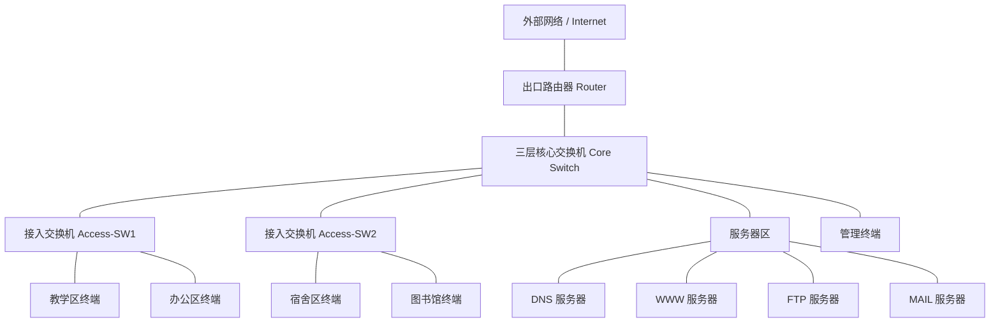
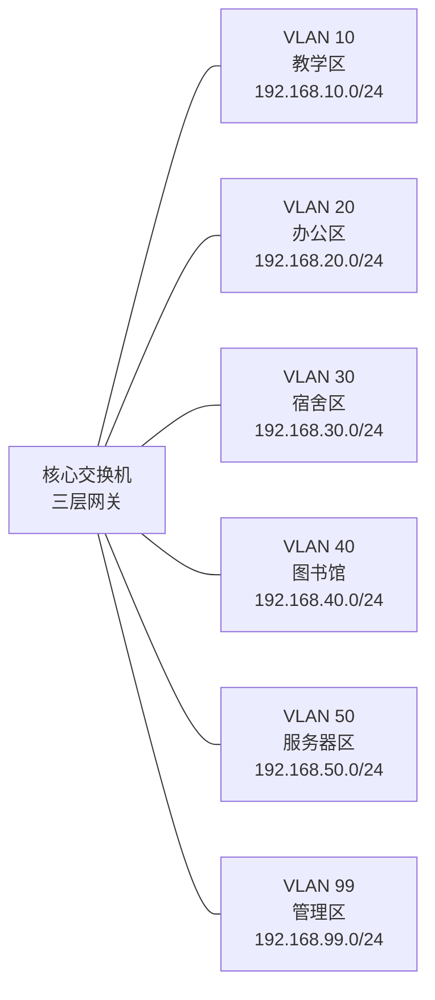
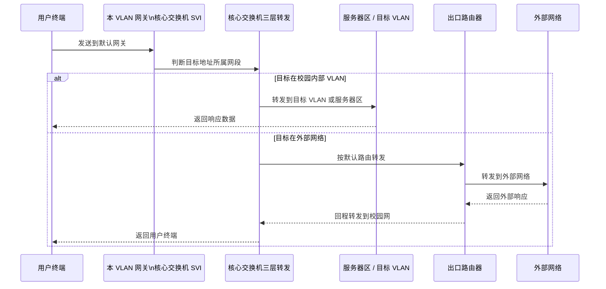
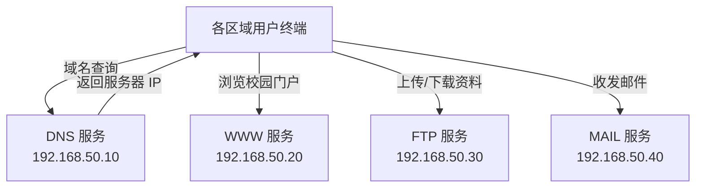
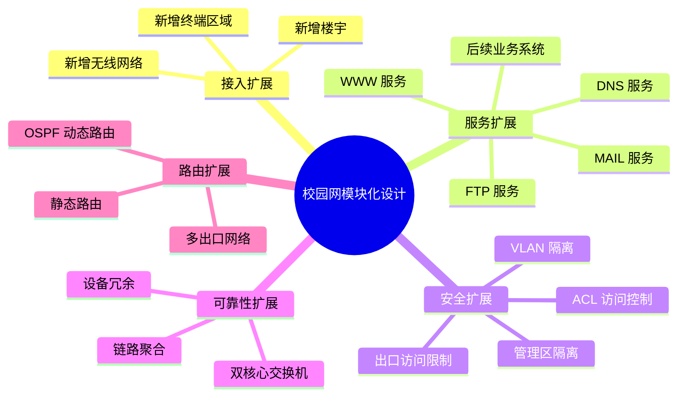

# 概要设计

## 1. 设计目标

本校园网络采用“核心层 + 接入层 + 服务器区 + 出口路由”的基础结构，先实现中小型校园网的基本功能：不同区域终端接入、VLAN 隔离、跨 VLAN 通信、基础服务器访问和外网出口访问。整体设计保持模块化，后续可以在不大幅调整整体结构的情况下继续扩展无线网络、访客认证、安全审计、冗余链路等功能。

## 2. 网络总体结构

校园网划分为以下几个基础模块：

| 模块 | 主要设备 | 主要功能 |
| --- | --- | --- |
| 出口模块 | 路由器 Router | 连接校园内网与外部网络，提供默认出口，可扩展 NAT、ACL 等功能 |
| 核心交换模块 | 三层核心交换机 Core Switch | 汇聚各区域接入交换机，承担 VLAN 网关和跨 VLAN 路由 |
| 接入模块 | 接入交换机 Access Switch | 连接教学楼、办公区、宿舍区等用户终端，并按 VLAN 接入 |
| 服务器模块 | 服务器交换区域/服务器主机 | 提供 WWW、FTP、DNS、MAIL 等基础网络服务 |
| 管理模块 | 管理 VLAN、管理员主机 | 用于后续对网络设备进行统一管理和维护 |

基础拓扑结构如下：

```text
                     外部网络 / Internet
                            |
                         Router
                            |
                     Core Switch（三层）
                    /      |       |      \
                   /       |       |       \
        Access-SW1   Access-SW2  Server区  管理终端
          /    \        /    \       |
       教学区  办公区  宿舍区  图书馆   WWW/DNS/FTP/MAIL
```

对应的 Mermaid 拓扑图如下：



该拓扑体现了分层和模块化思想：出口路由器负责外部网络连接，核心交换机负责汇聚和三层转发，接入交换机负责用户终端接入，服务器区集中提供基础网络服务。

## 3. VLAN 模块设计

为了减少广播域范围、隔离不同区域用户，并方便后续权限控制，校园网按功能区域划分 VLAN。初期只保留基础 VLAN，满足课程设计和基本通信需求。

| VLAN ID | VLAN 名称 | 对应区域 | 作用 |
| --- | --- | --- | --- |
| VLAN 10 | TEACHING | 教学区 | 教室、实验室等教学终端接入 |
| VLAN 20 | OFFICE | 行政办公区 | 教师、行政人员办公终端接入 |
| VLAN 30 | DORMITORY | 宿舍区 | 学生宿舍终端接入 |
| VLAN 40 | LIBRARY | 图书馆 | 图书馆查询终端和读者终端接入 |
| VLAN 50 | SERVER | 信息中心机房/服务器区 | 部署 WWW、FTP、DNS、MAIL 等服务器 |
| VLAN 99 | MANAGEMENT | 网络管理区 | 管理员主机和网络设备管理地址 |

接入交换机端口按照终端所在区域划入对应 VLAN；接入交换机与核心交换机之间使用 Trunk 链路，允许多个 VLAN 数据通过。核心交换机上配置各 VLAN 的三层网关，实现不同 VLAN 之间的路由通信。

VLAN 与网络区域关系如下：



每个 VLAN 对应一个独立子网，核心交换机作为这些子网的统一三层网关。这样既可以隔离广播域，也可以通过核心交换机集中控制不同区域之间的访问。

## 4. IP 地址与子网规划

采用私有地址段 `192.168.0.0/16` 作为校园内网地址空间，每个 VLAN 使用一个独立的 `/24` 子网，便于理解、配置和后续扩展。

| VLAN | 子网地址 | 网关地址 | 可用地址范围 | 用途 |
| --- | --- | --- | --- | --- |
| VLAN 10 | 192.168.10.0/24 | 192.168.10.1 | 192.168.10.2 - 192.168.10.254 | 教学区 |
| VLAN 20 | 192.168.20.0/24 | 192.168.20.1 | 192.168.20.2 - 192.168.20.254 | 办公区 |
| VLAN 30 | 192.168.30.0/24 | 192.168.30.1 | 192.168.30.2 - 192.168.30.254 | 宿舍区 |
| VLAN 40 | 192.168.40.0/24 | 192.168.40.1 | 192.168.40.2 - 192.168.40.254 | 图书馆 |
| VLAN 50 | 192.168.50.0/24 | 192.168.50.1 | 192.168.50.2 - 192.168.50.254 | 服务器区 |
| VLAN 99 | 192.168.99.0/24 | 192.168.99.1 | 192.168.99.2 - 192.168.99.254 | 管理区 |
| 出口链路 | 192.168.100.0/30 | 核心：192.168.100.2 / 路由器：192.168.100.1 | 点到点地址 | 核心交换机到出口路由器 |

核心交换机为各 VLAN 配置 SVI 接口，作为对应子网的默认网关。出口路由器与核心交换机之间使用独立的三层链路连接，核心交换机配置默认路由指向出口路由器。

## 5. 路由设计

基础阶段采用静态路由，配置简单、便于调试，适合中小型校园网课程设计场景。

- 核心交换机开启三层路由功能，负责 VLAN 10、20、30、40、50、99 之间的通信。
- 核心交换机配置默认路由，将非校园内网流量转发到出口路由器。
- 出口路由器配置到校园内部各网段的回程路由，下一跳指向核心交换机。
- 后续如果网络规模扩大，可以将静态路由替换为 OSPF 等动态路由协议。

基本路由过程如下：

```text
用户终端 -> 所属 VLAN 网关（核心交换机 SVI） -> 目标 VLAN 或出口路由器 -> 目标网络
```

跨 VLAN 访问和外网访问的数据转发过程如下：



该过程说明核心交换机既承担内部 VLAN 之间的三层转发，也把访问外部网络的流量交给出口路由器处理。

## 6. 基础服务设计

服务器统一放置在 VLAN 50 服务器区，方便集中管理和访问控制。初期规划以下基础服务：

| 服务 | 建议地址 | 主要功能 |
| --- | --- | --- |
| DNS 服务 | 192.168.50.10 | 提供校园内部域名解析，例如门户网站、FTP、邮件服务器名称解析 |
| WWW 服务 | 192.168.50.20 | 提供校园门户、通知公告或课程资源访问页面 |
| FTP 服务 | 192.168.50.30 | 提供教学资料、实验文件等文件上传下载服务 |
| MAIL 服务 | 192.168.50.40 | 提供基础邮件收发服务，用于模拟校园邮件系统 |

各用户 VLAN 默认允许访问服务器区的基础服务。后续如需加强安全性，可以通过 ACL 控制不同区域对服务器的访问范围，例如宿舍区只允许访问 WWW 和 DNS，办公区允许访问更多内部服务。

基础服务之间的关系如下：



用户访问校园门户、FTP 或邮件服务时，可以先通过 DNS 获取服务器地址，再访问对应的业务服务器。

## 7. 安全与访问控制设计

基础阶段先保证网络连通和区域隔离，安全策略采用简单可扩展的方式设计：

1. 通过 VLAN 将教学区、办公区、宿舍区、图书馆和服务器区划分为不同广播域。
2. 网络设备管理地址统一放入 VLAN 99，普通用户 VLAN 不直接作为设备管理网络。
3. 服务器集中放置在 VLAN 50，便于后续统一设置 ACL 和安全策略。
4. 出口路由器作为校园网统一出口，后续可扩展 NAT、访问控制和外网访问限制。
5. 可选配置 ACL：限制宿舍区访问办公区，允许各区域访问 DNS、WWW 等公共服务。

初期建议的访问原则如下：

| 源区域 | 目标区域 | 基础策略 |
| --- | --- | --- |
| 教学区 | 服务器区 | 允许访问基础服务 |
| 办公区 | 服务器区 | 允许访问基础服务 |
| 宿舍区 | 服务器区 | 允许访问 DNS、WWW、FTP |
| 图书馆 | 服务器区 | 允许访问 DNS、WWW |
| 普通用户区 | 管理区 | 默认不允许 |
| 管理区 | 网络设备 | 允许管理访问 |

## 8. 模块化扩展设计

为了便于后续修改和添加新功能，本设计按模块进行扩展：



| 可扩展模块 | 扩展方式 |
| --- | --- |
| 新增楼宇或区域 | 新增 VLAN、子网和接入交换机即可接入核心交换机 |
| 新增服务器 | 在 VLAN 50 中分配固定 IP，并补充 DNS 记录和访问策略 |
| 新增无线网络 | 增加无线 VLAN，例如 STAFF-WIFI、STUDENT-WIFI、GUEST-WIFI |
| 增强安全控制 | 在核心交换机或出口路由器上添加 ACL、防火墙策略 |
| 提高可靠性 | 增加双核心交换机、链路聚合、生成树优化或设备冗余 |
| 扩大路由规模 | 将静态路由替换为 OSPF 等动态路由协议 |

## 9. 主要功能实现过程概述

### 9.1 VLAN 与接入实现

在核心交换机和接入交换机上创建 VLAN 10、20、30、40、50、99。接入交换机连接终端的端口配置为 Access 模式，并划入对应 VLAN；接入交换机上联核心交换机的端口配置为 Trunk 模式，允许相关 VLAN 通过。

### 9.2 跨 VLAN 通信实现

核心交换机为每个 VLAN 创建三层虚接口，例如 VLAN 10 的网关为 `192.168.10.1`，VLAN 20 的网关为 `192.168.20.1`。终端将默认网关设置为本 VLAN 的网关地址后，不同 VLAN 间的数据通过核心交换机进行三层转发。

### 9.3 外网访问实现

核心交换机通过三层链路连接出口路由器。核心交换机配置默认路由指向出口路由器，出口路由器配置返回校园内网的静态路由。如果需要模拟互联网访问，可在出口路由器外侧连接外部网络或 ISP 设备。

### 9.4 服务器访问实现

DNS、WWW、FTP、MAIL 服务器部署在 VLAN 50，并配置固定 IP 地址。各用户区域终端通过核心交换机路由访问服务器区。DNS 服务负责将校园内部域名解析到对应服务器地址，用户可通过域名访问校园门户、FTP 和邮件服务。

## 10. 本阶段设计小结

本概要设计采用简单清晰的分层结构和模块化划分方式，先完成校园网的基础连通、区域隔离、服务器访问和出口访问功能。该结构适合在 Packet Tracer 等网络仿真软件中实现，也便于后续继续扩展 ACL、安全策略、无线网络、链路冗余和更多校园应用服务。
