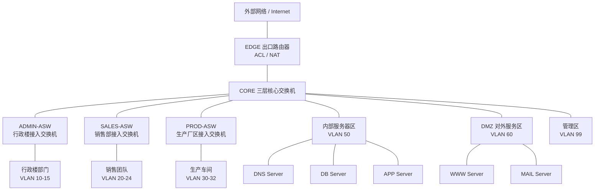
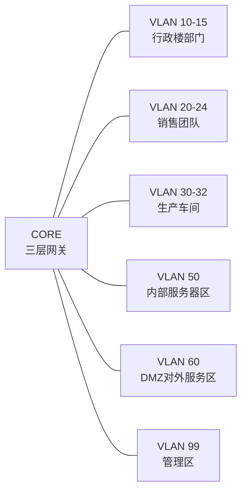
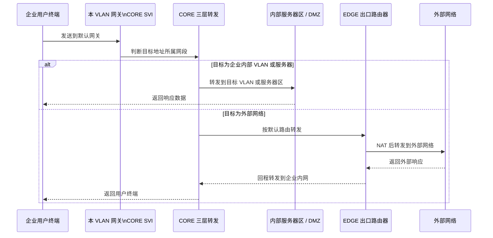
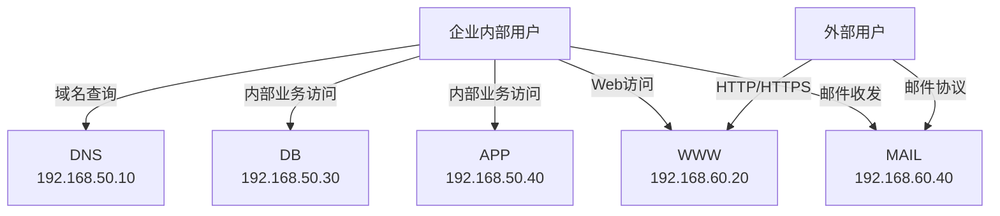
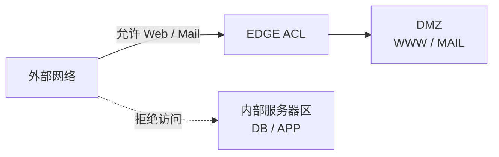
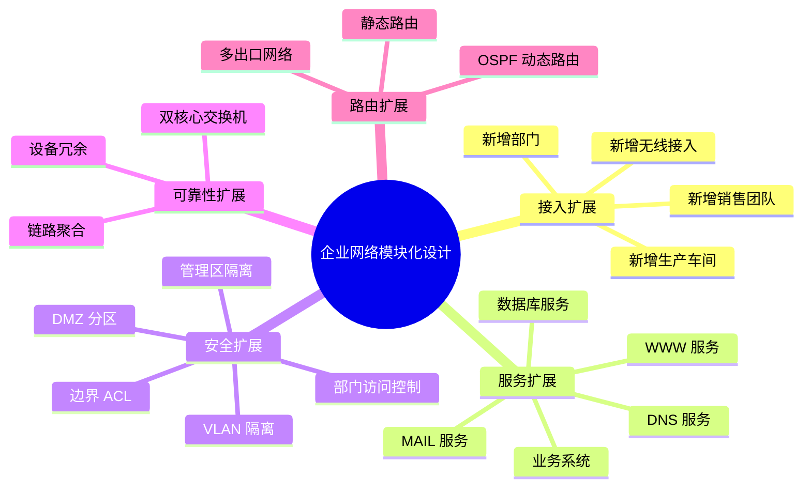

# 概要设计

## 1. 设计目标

本企业网络采用“出口边界层 + 核心交换层 + 接入层 + 服务器区”的分层结构，面向行政楼、销售部和生产厂区三个建筑进行统一规划。中心机房设在行政楼，核心交换机、内部服务器和对外服务区均汇聚到中心机房。

本设计需要满足以下目标：

1. 行政楼 6 个部门、销售部 5 个团队、生产厂区 3 个车间分别划分独立 VLAN，避免不同部门、团队、车间之间二层通信。
2. 核心交换机提供各 VLAN 的默认网关，实现企业内部必要的三层通信。
3. 内部服务器区部署数据库服务器和重要业务服务器，禁止外部网络直接访问。
4. DMZ 对外服务区部署 WWW 和 MAIL 服务，满足外部用户访问企业网站、内外用户使用邮件系统的需求。
5. 出口路由器连接外部网络，并通过 ACL 模拟边界防火墙，实现内外网访问控制。
6. 保留管理 VLAN，便于后续统一管理网络设备和扩展 DHCP、无线、冗余链路等功能。

## 2. 网络总体结构

企业网络划分为以下几个基础模块：

| 模块 | 主要设备 | 主要功能 |
| --- | --- | --- |
| 出口边界模块 | EDGE 出口路由器 | 连接企业内网与外部网络，配置静态路由、NAT 和外部访问 ACL |
| 核心交换模块 | CORE 三层核心交换机 | 汇聚接入交换机和服务器区，承担 VLAN 网关、跨 VLAN 路由和默认出口转发 |
| 行政楼接入模块 | ADMIN-ASW 接入交换机 | 接入总经理办公室、人力资源部、财务部、技术部、工会、保卫和后勤 |
| 销售部接入模块 | SALES-ASW 接入交换机 | 接入销售一队至销售五队 |
| 生产厂区接入模块 | PROD-ASW 接入交换机 | 接入一车间、二车间、三车间 |
| 内部服务器模块 | DNS、DB、APP Server | 提供内部域名解析、数据库服务和重要业务服务 |
| 对外服务模块 | WWW、MAIL Server | 提供内外均可访问的企业网站和邮件服务 |
| 管理模块 | 管理 VLAN、管理员主机 | 网络设备管理和后续运维扩展 |

基础拓扑结构如下：

```text
                         外部网络 / Internet
                                  |
                              EDGE Router
                                  |
                           CORE 三层核心交换机
          /             /          |          \              \
         /             /           |           \              \
   ADMIN-ASW      SALES-ASW     PROD-ASW    内部服务器区       DMZ服务区
    VLAN10-15     VLAN20-24    VLAN30-32   DNS/DB/APP        WWW/MAIL
```

对应的 Mermaid 拓扑图如下：



该拓扑体现了分层和安全分区思想：EDGE 控制内外边界，CORE 负责内部三层转发，三台接入交换机对应三个建筑或区域，内部服务器区和 DMZ 服务区分离部署，便于对不同服务采用不同访问策略。

## 3. VLAN 模块设计

为了减少广播域范围、实现部门隔离并满足“不同部门、团队、车间之间不能二层通信”的要求，本设计按企业组织结构划分 VLAN。

| VLAN ID | VLAN 名称 | 对应区域 | 作用 |
| --- | --- | --- | --- |
| VLAN 10 | ADMIN_GM | 总经理办公室 | 行政楼高层办公终端接入 |
| VLAN 11 | ADMIN_HR | 人力资源部 | 人力资源部终端接入 |
| VLAN 12 | ADMIN_FINANCE | 财务部 | 财务部终端接入，便于后续加强访问控制 |
| VLAN 13 | ADMIN_TECH | 技术部 | 技术部终端接入 |
| VLAN 14 | ADMIN_UNION | 工会 | 工会终端接入 |
| VLAN 15 | ADMIN_SEC_LOG | 保卫和后勤 | 保卫和后勤终端接入 |
| VLAN 20 | SALES_T1 | 销售一队 | 销售一队终端接入 |
| VLAN 21 | SALES_T2 | 销售二队 | 销售二队终端接入 |
| VLAN 22 | SALES_T3 | 销售三队 | 销售三队终端接入 |
| VLAN 23 | SALES_T4 | 销售四队 | 销售四队终端接入 |
| VLAN 24 | SALES_T5 | 销售五队 | 销售五队终端接入 |
| VLAN 30 | PROD_WS1 | 一车间 | 生产一车间终端接入 |
| VLAN 31 | PROD_WS2 | 二车间 | 生产二车间终端接入 |
| VLAN 32 | PROD_WS3 | 三车间 | 生产三车间终端接入 |
| VLAN 50 | SERVER_IN | 内部服务器区 | DNS、数据库服务器、重要业务服务器 |
| VLAN 60 | DMZ_SERVICE | 对外服务区 | WWW、MAIL 等内外均可访问服务 |
| VLAN 99 | MANAGEMENT | 网络管理区 | 管理员主机和网络设备管理地址 |

接入交换机连接用户终端的端口配置为 Access 模式，并划入对应 VLAN；接入交换机与 CORE 之间使用 Trunk 链路，只放行本区域所需 VLAN 和管理 VLAN。CORE 为每个 VLAN 配置 SVI 接口，作为该 VLAN 的默认网关。

VLAN 与网络区域关系如下：



每个 VLAN 对应一个独立三层子网。这样既能保证不同部门不在同一二层广播域，也能通过 CORE 集中控制不同区域之间的三层访问。

## 4. IP 地址与子网规划

采用私有地址段 `192.168.0.0/16` 作为企业内网地址空间，每个业务 VLAN 使用一个独立 `/24` 子网，便于配置、演示和后续扩展。

| VLAN | 子网地址 | 网关地址 | 可用地址范围 | 用途 |
| --- | --- | --- | --- | --- |
| VLAN 10 | 192.168.10.0/24 | 192.168.10.1 | 192.168.10.2 - 192.168.10.254 | 总经理办公室 |
| VLAN 11 | 192.168.11.0/24 | 192.168.11.1 | 192.168.11.2 - 192.168.11.254 | 人力资源部 |
| VLAN 12 | 192.168.12.0/24 | 192.168.12.1 | 192.168.12.2 - 192.168.12.254 | 财务部 |
| VLAN 13 | 192.168.13.0/24 | 192.168.13.1 | 192.168.13.2 - 192.168.13.254 | 技术部 |
| VLAN 14 | 192.168.14.0/24 | 192.168.14.1 | 192.168.14.2 - 192.168.14.254 | 工会 |
| VLAN 15 | 192.168.15.0/24 | 192.168.15.1 | 192.168.15.2 - 192.168.15.254 | 保卫和后勤 |
| VLAN 20 | 192.168.20.0/24 | 192.168.20.1 | 192.168.20.2 - 192.168.20.254 | 销售一队 |
| VLAN 21 | 192.168.21.0/24 | 192.168.21.1 | 192.168.21.2 - 192.168.21.254 | 销售二队 |
| VLAN 22 | 192.168.22.0/24 | 192.168.22.1 | 192.168.22.2 - 192.168.22.254 | 销售三队 |
| VLAN 23 | 192.168.23.0/24 | 192.168.23.1 | 192.168.23.2 - 192.168.23.254 | 销售四队 |
| VLAN 24 | 192.168.24.0/24 | 192.168.24.1 | 192.168.24.2 - 192.168.24.254 | 销售五队 |
| VLAN 30 | 192.168.30.0/24 | 192.168.30.1 | 192.168.30.2 - 192.168.30.254 | 一车间 |
| VLAN 31 | 192.168.31.0/24 | 192.168.31.1 | 192.168.31.2 - 192.168.31.254 | 二车间 |
| VLAN 32 | 192.168.32.0/24 | 192.168.32.1 | 192.168.32.2 - 192.168.32.254 | 三车间 |
| VLAN 50 | 192.168.50.0/24 | 192.168.50.1 | 192.168.50.2 - 192.168.50.254 | 内部服务器区 |
| VLAN 60 | 192.168.60.0/24 | 192.168.60.1 | 192.168.60.2 - 192.168.60.254 | DMZ 对外服务区 |
| VLAN 99 | 192.168.99.0/24 | 192.168.99.1 | 192.168.99.2 - 192.168.99.254 | 网络管理区 |
| 出口链路 | 192.168.100.0/30 | CORE：192.168.100.2 / EDGE：192.168.100.1 | 点到点地址 | CORE 到 EDGE |
| 外部模拟网络 | 200.1.1.0/24 | EDGE：200.1.1.1 | 200.1.1.2 - 200.1.1.254 | 模拟 Internet |

核心交换机为各 VLAN 配置 SVI 接口。用户终端默认网关指向本 VLAN 的 SVI 地址，DNS 地址统一指向内部 DNS Server `192.168.50.10`。

## 5. 路由设计

基础阶段采用静态路由，配置简单，便于在 Packet Tracer 中演示和排错。

- CORE 开启三层路由功能，负责 VLAN 10-15、20-24、30-32、50、60、99 之间的三层转发。
- CORE 配置默认路由，将非企业内网流量转发到 EDGE。
- EDGE 配置到企业内部 `192.168.0.0/16` 的回程路由，下一跳指向 CORE。
- EDGE 外侧连接模拟外部网络，内部用户访问外部网络时可通过 NAT 转换。
- 后续如果网络规模扩大，可将静态路由替换为 OSPF 等动态路由协议。

基本路由过程如下：

```text
用户终端 -> 所属 VLAN 网关（CORE SVI） -> 目标 VLAN / 服务器区 / EDGE -> 目标网络
```

跨 VLAN、服务器访问和外网访问的数据转发过程如下：



## 6. 服务设计

服务器按安全级别划分为内部服务器区和 DMZ 对外服务区。

| 服务 | 建议地址 | 所属区域 | 主要功能 |
| --- | --- | --- | --- |
| DNS 服务 | 192.168.50.10 | VLAN 50 内部服务器区 | 提供企业内部域名解析 |
| DB 服务 | 192.168.50.30 | VLAN 50 内部服务器区 | 模拟数据库服务器，禁止外部直接访问 |
| APP 服务 | 192.168.50.40 | VLAN 50 内部服务器区 | 模拟重要业务服务器，禁止外部直接访问 |
| WWW 服务 | 192.168.60.20 | VLAN 60 DMZ | 提供企业对外网站，内外均可访问 |
| MAIL 服务 | 192.168.60.40 | VLAN 60 DMZ | 提供企业邮件服务，内外均可访问 |

DNS 中规划以下解析记录：

| 域名 | IP 地址 | 用途 |
| --- | --- | --- |
| www.company.local | 192.168.60.20 | 企业网站 |
| mail.company.local | 192.168.60.40 | 邮件服务 |
| db.company.local | 192.168.50.30 | 内部数据库 |
| app.company.local | 192.168.50.40 | 内部业务系统 |

基础服务访问关系如下：



外部用户只允许访问 DMZ 中的 WWW 和 MAIL，不能访问 VLAN 50 的 DB 和 APP。

## 7. 安全与访问控制设计

本设计采用 VLAN 隔离、服务器分区和出口 ACL 三类策略实现基础安全控制。

1. 通过 VLAN 将行政部门、销售团队、生产车间划分为不同二层广播域，满足不能二层通信的要求。
2. 数据库服务器和重要业务服务器放入 VLAN 50 内部服务器区，不向外部网络开放。
3. WWW 和 MAIL 放入 VLAN 60 DMZ，对外提供必要服务，降低内部服务器暴露风险。
4. EDGE 外侧接口配置 ACL，允许外部访问 `192.168.60.20` 的 Web 服务和 `192.168.60.40` 的邮件服务，拒绝访问企业内部网段。
5. 网络设备管理地址统一放入 VLAN 99，普通用户 VLAN 不作为设备管理网络。
6. 后续可在 CORE 上增加部门间访问 ACL，例如限制普通部门访问财务部，或只允许技术部访问部分服务器管理端口。

基础访问原则如下：

| 源区域 | 目标区域 | 基础策略 |
| --- | --- | --- |
| 企业内部用户 VLAN | DNS Server | 允许 |
| 企业内部用户 VLAN | WWW / MAIL | 允许 |
| 企业内部用户 VLAN | DB / APP | 按业务需要允许 |
| 外部网络 | WWW Server | 允许 HTTP/HTTPS |
| 外部网络 | MAIL Server | 允许必要邮件协议 |
| 外部网络 | DB / APP | 拒绝 |
| 普通用户 VLAN | 管理区 | 默认不允许 |
| 管理区 | 网络设备 | 允许管理访问 |

边界访问控制示意如下：



## 8. 模块化扩展设计

为了便于后续修改和添加新功能，本设计按模块扩展：



| 可扩展模块 | 扩展方式 |
| --- | --- |
| 新增部门或团队 | 新增 VLAN、子网和接入端口即可接入 CORE |
| 新增服务器 | 按安全级别放入 VLAN 50 或 VLAN 60，并补充 DNS 记录和访问策略 |
| 增强安全控制 | 在 CORE 或 EDGE 上增加 ACL、防火墙策略和管理访问限制 |
| 提高可靠性 | 增加双核心交换机、链路聚合、生成树优化或设备冗余 |
| 扩大路由规模 | 将静态路由替换为 OSPF 等动态路由协议 |
| 简化终端配置 | 后续部署 DHCP，为各 VLAN 自动分配地址 |

## 9. 主要功能实现过程概述

### 9.1 VLAN 与接入实现

在 CORE 和接入交换机上创建 VLAN 10-15、20-24、30-32、50、60、99。ADMIN-ASW 接入行政楼各部门，SALES-ASW 接入销售团队，PROD-ASW 接入生产车间。终端端口配置为 Access 模式，上联 CORE 的端口配置为 Trunk 模式。

### 9.2 三层通信实现

CORE 为每个 VLAN 创建三层虚接口，例如 VLAN 10 的网关为 `192.168.10.1`，VLAN 50 的网关为 `192.168.50.1`。终端将默认网关设置为本 VLAN 的网关地址后，不同 VLAN 间的数据通过 CORE 进行三层转发。

### 9.3 外网访问实现

CORE 通过三层链路连接 EDGE。CORE 配置默认路由指向 `192.168.100.1`，EDGE 配置到企业内网 `192.168.0.0/16` 的回程路由，内部用户通过 EDGE 访问外部网络。EDGE 可配置 NAT，使内网私有地址能够访问模拟外部网络。

### 9.4 内部服务器保护实现

DNS、DB、APP 服务器部署在 VLAN 50。外部网络访问进入 EDGE 后，由外侧 ACL 拒绝访问企业内部 `192.168.0.0/16` 中非公开服务地址，从而保护数据库服务器和重要业务服务器。

### 9.5 对外服务实现

WWW 和 MAIL 服务器部署在 VLAN 60 DMZ。EDGE ACL 允许外部访问 WWW 的 HTTP/HTTPS 端口和 MAIL 的邮件相关端口；企业内部用户也可以通过 CORE 访问 DMZ 服务区。

## 10. 本阶段设计小结

本概要设计将原有简单分层网络扩展为企业三建筑网络方案，通过多 VLAN 划分、CORE 三层转发、内部服务器区、DMZ 对外服务区和 EDGE 边界 ACL，满足新命题文件中企业网络的主要需求。该结构适合在 Packet Tracer 中实现，也便于后续继续补充详细配置、测试记录、截图和报告正文。
